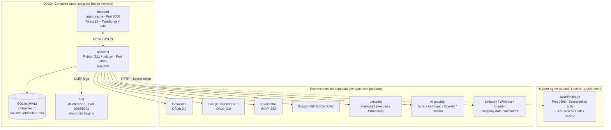
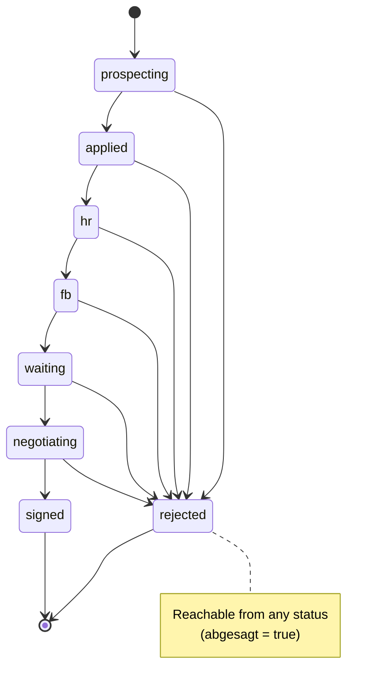
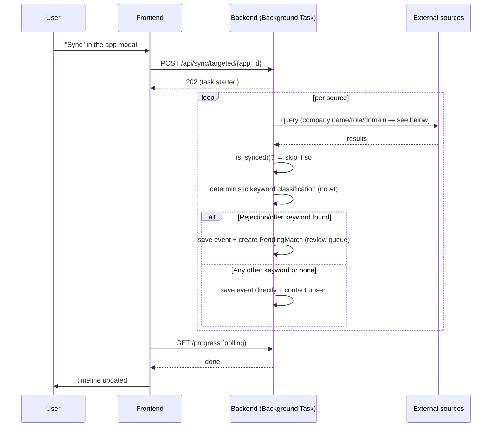
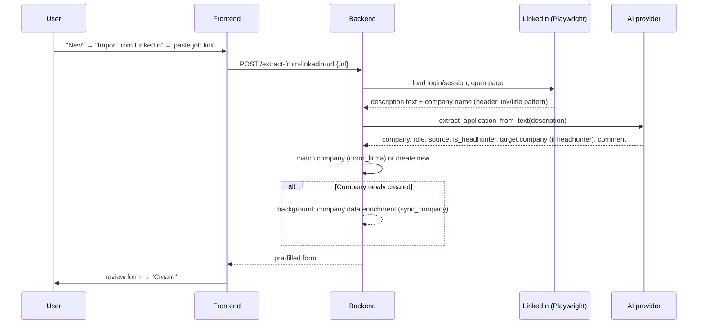
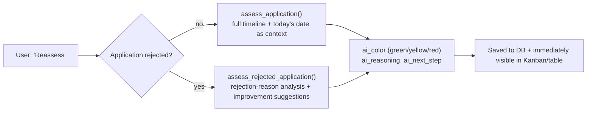
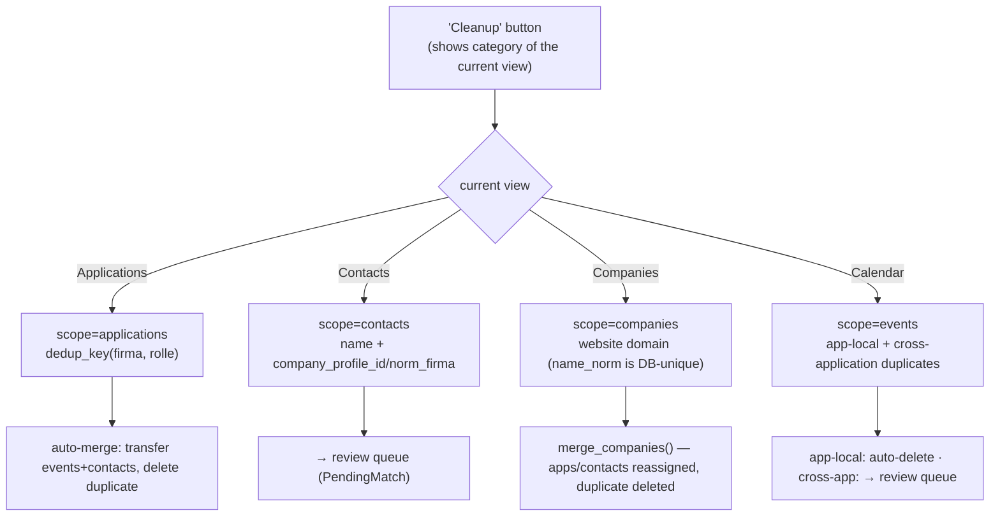
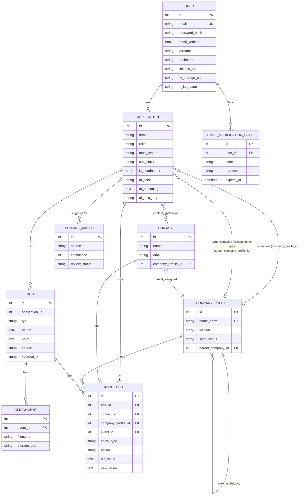
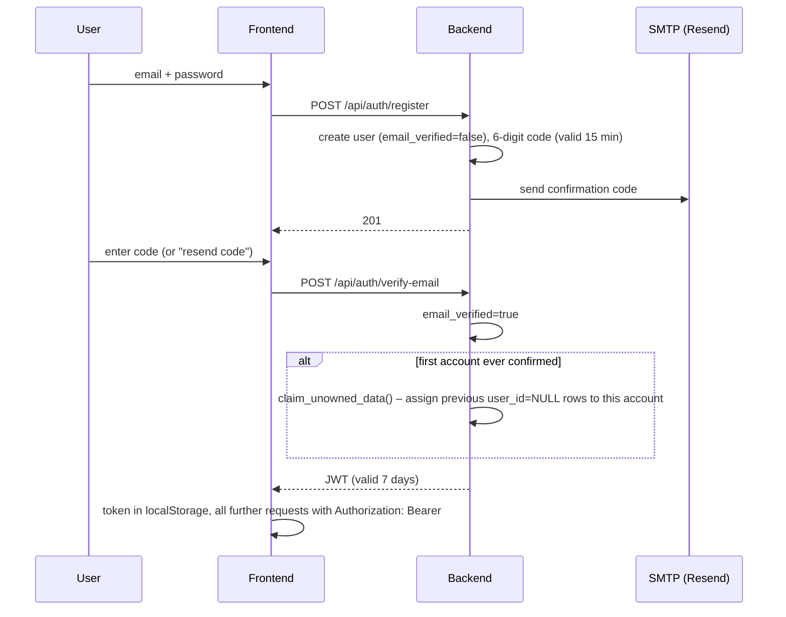
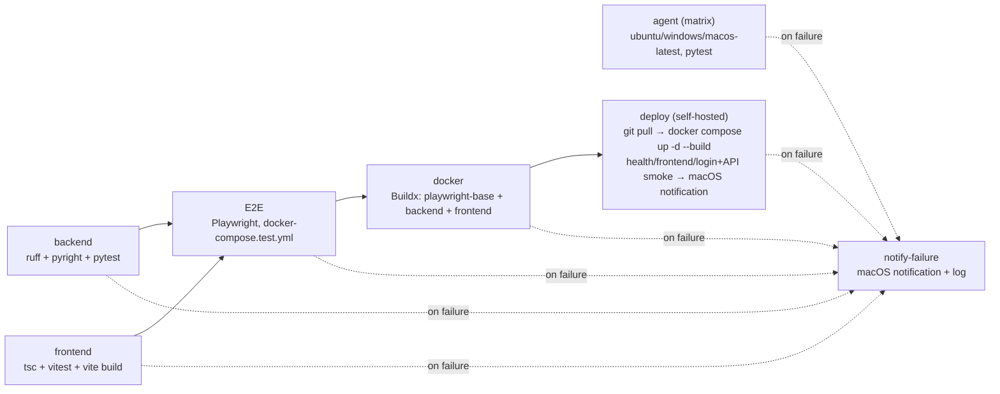

# rapport – Technical Architecture

> This document describes the **current implementation** (as of v4.3.2, 2026-07-16). The original planning document with vision and roadmap: [Rapport_Konzept_Architektur.md](Rapport_Konzept_Architektur.md)
>
> Diagrams are embedded as [Mermaid](https://mermaid.js.org/) — GitHub renders them automatically when viewing the file. No external tool needed to view; a text editor is enough to edit them.

## Table of Contents

1. [System and Software Architecture](#1-system-and-software-architecture)
2. [API Interfaces (Internal)](#2-api-interfaces-internal)
3. [External Interfaces (Sync Sources)](#3-external-interfaces-sync-sources)
4. [Status Transitions](#4-status-transitions)
5. [Workflows](#5-workflows)
6. [Data Model](#6-data-model)
7. [Authentication & Multi-Tenancy](#7-authentication--multi-tenancy)
8. [CI/CD](#8-cicd)
9. [Internationalization (i18n)](#9-internationalization-i18n)

---

## 1. System and Software Architecture

### Overview



### Technology Stack

| Layer | Technology | Version |
|---|---|---|
| Frontend framework | React | 18 |
| Frontend language | TypeScript | 5 |
| Frontend styling | Tailwind CSS | 3 |
| Frontend build | Vite | 5 |
| Frontend serving | nginx (Alpine) | stable |
| Backend framework | FastAPI | 0.110+ |
| Backend language | Python | 3.11 |
| Backend server | uvicorn | 0.29+ |
| ORM | SQLAlchemy | 2.0 |
| Database | SQLite (WAL mode) | 3 |
| Cryptography | cryptography (Fernet) | 42+ |
| AI classification | litellm (provider-agnostic) | latest |
| Excel import/export | openpyxl | 3.1+ |
| PDF export | fpdf2 | 2.8+ |
| LinkedIn scraper / job import | Playwright | latest |
| Logging | Loguru → Seq (CLEF) | – |
| Containerization | Docker Compose | v2 |

### Container Configuration

**`docker-compose.yml`** defines three services:

| Service | Image / Build | Port | Volume |
|---|---|---|---|
| `backend` | `./backend` Dockerfile | `8000:8000` | `jobtracker-data:/app/data` |
| `frontend` | `./frontend` Dockerfile (build arg `BUILD_NUMBER`) | `3000:80` | – |
| `seq` | `datalust/seq:latest` | `8088:80`, `5341:5341` | `seq-data:/data` |

Both app containers get `TZ=Europe/Berlin`. Backend additionally gets `SEQ_URL=http://seq:5341` and `LOG_LEVEL=INFO`. Backend also gets `extra_hosts: host.docker.internal:host-gateway` (added for Linux Docker compatibility — macOS/Windows Docker already resolve `host.docker.internal` natively). As of 2026-07-13 (the cross-platform portability work), container IPs are no longer statically pinned — always reach the app via `localhost` + the published port, never a hardcoded container IP (see CLAUDE.md's "Important Constants").

The SQLite file lives in the named volume `jobtracker-data` (pinned via `name: jobtracker_jobtracker-data` in `docker-compose.yml` — a relic of the app's pre-rename name, kept explicit deliberately: an unpinned/auto-named volume swap on 2026-07-14 caused Docker Compose to attach a brand-new, empty volume on redeploy) at `/app/data/jobtracker.db`. The schema is created/extended at startup via SQLAlchemy `create_all()` plus additive inline migrations in `database.py` — no Alembic.

### Project Structure (Backend)

```
backend/app/
├── main.py                  FastAPI app, CORS, lifespan, router registration
├── database.py               SQLAlchemy engine + SessionLocal + get_db + inline migrations
├── models.py                  ORM models, status enums, Excel mapping constants
├── schemas.py                 Pydantic request/response schemas
├── audit.py                   add_audit() – audit log helper (level: off/normal/verbose), references Application/Contact/CompanyProfile/Event; reason_key/reason_params resolve a translated reason via i18n_strings.t() in the account's ui_language
├── error_keys.py              ErrorKey enum + api_error() – stable error keys for HTTP responses, translated frontend-side (see §9)
├── i18n_strings.py            Server-generated user-facing strings (audit reasons, sync progress) that can't be re-translated client-side — t(key, lang) + resolve_ui_language(db, user_id) (see §9)
├── agent_client.py             HTTP client for the Rapport Agent (bearer token, base URL from settings/env)
├── dedup.py                   norm_firma()/norm_rolle()/dedup_key() – normalization for duplicate detection
├── logger.py                  Loguru setup, JSON log + Seq sink (CLEF)
├── linkedin_job_description.py  Load job description + company name from a LinkedIn URL (Playwright)
├── ai/
│   ├── provider.py          litellm wrapper, Fernet cryptography, AINotConfigured/AIRateLimited/AIBadRequest
│   └── tasks.py              Classification/assessment/extraction prompts (assess_application, extract_application_from_text, match_and_classify, …)
├── auth/
│   ├── security.py          Password hashing (bcrypt), JWT encode/decode, 6-digit confirmation codes
│   ├── dependencies.py       get_current_user() – dependency, reads bearer token, activates tenant filter
│   └── email.py               SMTP delivery of confirmation codes (registration/password reset)
└── routers/
    ├── auth.py                Registration, email confirmation, login, password reset, account (see §7)
    ├── applications.py       CRUD + events + contacts + AI assessment + LinkedIn import
    ├── contacts.py            Global contact management
    ├── companies.py           Company profiles: CRUD, logo, contact linking
    ├── merge.py                Merge applications/companies/contacts
    ├── cleanup.py              Duplicate detection + cleanup (scope-capable)
    ├── import_excel.py        POST /api/import/excel
    ├── export_excel.py        GET /api/export/excel
    ├── export_pdf.py           GET /api/export/pdf
    ├── attachments.py          File attachments on timeline events
    ├── settings.py             AI settings, logo API key, sync toggles, Ollama models
    ├── geo.py                   Location autocomplete (Google Places, fallback Nominatim)
    ├── calendar.py             GET /api/calendar/events
    ├── analytics.py            Pipeline funnel and rejection statistics
    ├── audit_log.py            Read/delete audit trail
    ├── backup.py                Configure/run local DB backups
    ├── sync_common.py          Shared helpers: dedup, AI classification, contact upsert
    ├── sync_google.py          Google OAuth + Gmail + GCal
    ├── sync_icloud.py          iCloud mail/calendar/notes/reminders/contacts/calls
    ├── sync_targeted.py        Per-application sync across all sources + manual candidate assignment
    ├── sync_files.py            Local documents via Rapport Agent (port 9996)
    ├── sync_linkedin.py         LinkedIn Playwright scraper (own applications) with inline 2FA
    ├── sync_company.py          Company data enrichment (DuckDuckGo → Wikipedia → Clearbit logo)
    ├── review.py                Manual review queue (PendingMatches)
    ├── startup_check.py        Health/bridge connectivity check
    └── test_e2e.py              E2E-only test-user setup (POST /api/e2e/setup-user), active only when E2E_TESTING=true
```

### Project Structure (Frontend)

```
frontend/src/
├── App.tsx                 Root component: tabs (Applications/Contacts/Companies/Calendar/Analytics), toolbar, modal orchestration
├── AppRoutes.tsx             Routing: /login, /register, /verify-email, /forgot-password, /reset-password, protected root route
├── types.ts                 TypeScript types, status labels/colors, constants
├── api/client.ts             Fetch wrapper for all backend calls, grouped by namespace; attaches bearer token, handles 401 centrally
├── context/AuthContext.tsx    Login state, token in localStorage, login()/register()/logout()/…, propagates user.ui_language to i18next on login/refresh/logout
├── pages/auth/                LoginPage, RegisterPage, VerifyEmailPage, ForgotPasswordPage, ResetPasswordPage, AuthLayout
├── i18n/                       react-i18next setup (see §9): index.ts (provider/registration), useLocale.ts, formatDate.ts, errorMessage.ts, statusLabels.ts, locales/{de,en}/*.json per feature area
└── components/
    ├── RequireAuth.tsx          Route guard: redirects to /login when not signed in
    ├── ApplicationTable.tsx    Sortable table view
    ├── KanbanBoard.tsx          Kanban with drag & drop
    ├── ApplicationModal.tsx     Detail/edit modal: lifecycle bar, timeline, attachments, contacts, AI assessment
    ├── CalendarView.tsx          Calendar view (day/week/month)
    ├── StatsBar.tsx               KPI tiles
    ├── StatusBadge.tsx            Colored status badges
    ├── StatusPopover.tsx          Inline status change
    ├── ContactsView.tsx            Contacts overview
    ├── ContactModal.tsx            Contact detail/edit
    ├── CompaniesView.tsx            Companies overview (selection → scoped sync/merge/cleanup)
    ├── CompanyModal.tsx              Company profile detail/edit
    ├── CompanyLogo.tsx                Company logo with fallback
    ├── CompanyFilterPicker.tsx        Company filter autocomplete
    ├── MergeDialog.tsx                 AppMergeDialog / CompanyMergeDialog / ContactMergeDialog
    ├── CleanupModal.tsx                 Duplicate cleanup, context-sensitive (scope prop)
    ├── ReviewModal.tsx                   Review inbox for AI/sync suggestions
    ├── SettingsModal.tsx                  Settings (tabs: Account/Sync/AI/Google/iCloud/Calls/Documents/LinkedIn/Backup/Logos/Maps/Agent)
    ├── SyncButton.tsx                      Global sync trigger + progress indicator
    ├── ImportButton.tsx / ExportButton.tsx / PdfExportButton.tsx / ImportExportMenu.tsx
    ├── AuditLogModal.tsx                   Audit trail view
    ├── AnalyticsView.tsx                    Funnel/conversion dashboard
    ├── ChangelogModal.tsx                   Version history (CURRENT_VERSION maintained here)
    └── StartupWarningBanner.tsx             Warning banner for bridge/connection problems
```

---

## 2. API Interfaces (Internal)

Swagger UI: `http://localhost:8000/docs`

All endpoints except `/api/auth/register`, `/api/auth/verify-email`, `/api/auth/resend-code`, `/api/auth/login`, `/api/auth/forgot-password`, `/api/auth/reset-password`, `/api/startup-check`, and `/health` require `Authorization: Bearer <jwt>`. Details in [§7](#7-authentication--multi-tenancy).

### Authentication

| Method | Path | Description |
|---|---|---|
| `POST` | `/api/auth/register` | Create account, confirmation code by email (409 if already registered) |
| `POST` | `/api/auth/verify-email` | Verify code, activate account, return JWT |
| `POST` | `/api/auth/resend-code` | Send a new confirmation code (unverified account) |
| `POST` | `/api/auth/login` | Login, return JWT (403 if email not confirmed) |
| `POST` | `/api/auth/forgot-password` | Reset code by email (always 200, no user enumeration) |
| `POST` | `/api/auth/reset-password` | Verify reset code, set new password |
| `GET` | `/api/auth/me` | Current account (requires login) |
| `POST` | `/api/auth/change-password` | Change password (requires login) |
| `PATCH` | `/api/auth/profile` | Update `vorname`/`nachname`/`linkedin_url`/`ui_language` — payload must always send the current `ui_language` alongside any partial update, or it gets overwritten with the default |
| `POST`/`GET`/`DELETE` | `/api/auth/cv` | Upload/inspect/delete the account's CV file (stored at `{DB_DIR}/user_files/{user_id}/`) |

### Applications

| Method | Path | Description |
|---|---|---|
| `GET` | `/api/applications/` | List (filters: `main_status`, `search`, `show_rejected`) |
| `GET` | `/api/applications/stats` | KPI numbers |
| `GET` | `/api/applications/ai-assess-all` | AI assessment of all active applications (SSE stream with progress) |
| `POST` | `/api/applications/extract-from-linkedin-url` | Load job posting from LinkedIn URL, extract fields via AI, match/create company |
| `GET` | `/api/applications/{id}` | Detail with events + contacts |
| `POST` | `/api/applications/` | Create new (automatically creates a `bewerbung` event) |
| `PATCH` | `/api/applications/{id}` | Update fields (creates an event on status change) |
| `DELETE` | `/api/applications/{id}` | Delete (cascades events + contact_application) |
| `POST` | `/api/applications/{id}/ai-assess` | Single assessment (success chance green/yellow/red + reasoning + next step) |

### Events (Timeline) & Contacts (per Application)

| Method | Path | Description |
|---|---|---|
| `GET`/`POST` | `/api/applications/{id}/events` | Read timeline / manually add an event |
| `PATCH`/`DELETE` | `/api/applications/{id}/events/{eid}` | Edit / delete event |
| `DELETE` | `/api/applications/{id}/events/bulk` | Delete multiple events at once (`{ids: [...]}`) — registered before `/{eid}` so Starlette doesn't swallow `bulk` as an id |
| `GET`/`POST` | `/api/applications/{id}/contacts` | Contacts of the application / create+link |
| `PATCH`/`PUT`/`DELETE` | `/api/applications/{id}/contacts/{cid}` | Edit contact / remove link |
| `DELETE` | `/api/applications/{id}/contacts/bulk` | Unlink/delete multiple contacts at once (`{ids: [...]}`) |

### Contacts (Global) & Attachments

| Method | Path | Description |
|---|---|---|
| `GET`/`POST` | `/api/contacts/` | All contacts / create |
| `PATCH` | `/api/contacts/{id}` | Edit |
| `DELETE` | `/api/contacts/bulk` | Delete multiple |
| `POST` | `/api/attachments/{event_id}/upload` | Attach a file to an event |
| `GET` | `/api/attachments/{id}/download` | Download attachment |
| `DELETE` | `/api/attachments/{id}` | Delete attachment |

### Companies

| Method | Path | Description |
|---|---|---|
| `GET`/`POST` | `/api/companies` | List / create |
| `GET`/`PATCH` | `/api/companies/{id}` | Detail / edit |
| `POST`/`DELETE` | `/api/companies/{id}/logo` | Upload / delete logo |
| `POST`/`DELETE` | `/api/companies/{id}/contacts/{cid}` | Link / remove contact |
| `DELETE` | `/api/companies/bulk` | Delete multiple |
| `POST` | `/api/companies/link-contacts` | Automatically link orphaned contacts by company name (`?company_ids=` optional) |
| `GET`/`POST` | `/api/companies/link-contacts/status` \| `/cancel` | Progress / cancel |
| `GET`/`POST` | `/api/sync/company/status` \| `/run` | Company data enrichment: status / start (`?force=&company_ids=` optional) |
| `POST` | `/api/sync/company/cancel` \| `/reset-lock` \| `/reset-failed` | Control |

### Merge & Cleanup

| Method | Path | Description |
|---|---|---|
| `POST` | `/api/merge/applications` \| `/companies` \| `/contacts` | Merge two or more duplicates into one |
| `GET` | `/api/cleanup/preview` | Duplicates found, optional `?scope=applications\|contacts\|companies\|events` |
| `POST` | `/api/cleanup/run` | Run cleanup (same `scope` parameter) |
| `GET` | `/api/cleanup/progress` | Progress |

### Import / Export

| Method | Path | Description |
|---|---|---|
| `POST` | `/api/import/excel` | Excel upload ("Tracking" sheet) |
| `GET` | `/api/export/excel` | Excel download (`?show_rejected=true` optional) |
| `GET` | `/api/export/pdf` | PDF export of job-search activity |

### Sync – Google / iCloud / Targeted / LinkedIn / Files

| Method | Path | Description |
|---|---|---|
| `POST`/`GET`/`DELETE` | `/api/sync/google/*` | OAuth credentials, status, Gmail/GCal sync |
| `POST`/`GET`/`DELETE` | `/api/sync/icloud/*` | Mail/calendar/notes/reminders/contacts/calls |
| `POST` | `/api/sync/targeted/{app_id}` | Sync all sources for one application — also auto-triggered as a background task right after an application is created (manual, LinkedIn import, or bulk LinkedIn scrape), see §5.2 |
| `GET` | `/api/sync/targeted/{app_id}/candidates` | Candidates for manual assignment (full-text search across all sources) |
| `POST` | `/api/sync/targeted/{app_id}/assign` | Manually assign a candidate |
| `GET`/`POST`/`DELETE` | `/api/sync/linkedin/*` | LinkedIn login, session, scraper start, 2FA |
| `GET`/`POST` | `/api/sync/linkedin/people/search` \| `/people/import` | Manual contact import: LinkedIn people search → import selection |
| `GET`/`POST` | `/api/sync/linkedin/companies/search` \| `/companies/import` | Manual company import: LinkedIn company search → import selection |
| `GET`/`POST` | `/api/sync/icloud/contacts/search` \| `/contacts/import` | Manual contact import: full-text search in iCloud address book → import selection |
| `GET`/`POST` | `/api/sync/files/*` | Local documents (Rapport Agent) |

### Calendar, Review, Analytics, Audit, Backup, Settings

| Method | Path | Description |
|---|---|---|
| `GET` | `/api/calendar/events` | All calendar events (`?start=&end=`) |
| `GET`/`POST`/`DELETE` | `/api/review/*` | Review queue for AI/sync suggestions |
| `GET` | `/api/analytics/summary` | Pipeline funnel + rejection statistics |
| `GET`/`DELETE` | `/api/audit/` | Read / delete audit trail |
| `GET`/`POST` | `/api/backup/*` | Backup configuration, manual run, restore |
| `GET`/`POST`/`DELETE` | `/api/settings/*` | AI provider, logo key, sync toggles, documents folder, agent URL/token, maps API key |
| `GET` | `/api/startup-check` | Health/bridge connectivity check |
| `GET` | `/api/geo/search` | Location autocomplete (Google Places, fallback Nominatim) |
| `GET` | `/health` | Health check |

---

## 3. External Interfaces (Sync Sources)

### 3.1 Gmail API (Google OAuth 2.0)

- **Protocol:** REST, `google-auth` + `google-api-python-client`
- **OAuth flow:** authorization code flow; redirect URI `http://localhost:8000/api/sync/google/callback`
- **Tokens:** Fernet-encrypted in `google_sync.access_token_enc` / `refresh_token_enc`
- **Dedup:** `synced_items` with `source="gmail"` and Gmail message ID

### 3.2 Google Calendar API

- **Sync strategy:** events from all calendars; company/role as search term
- **Change detection:** moved/renamed events are updated on re-sync; events that no longer exist (no longer in the sync window's `uid_set`) are deleted locally — the external calendar always takes precedence
- **Contact extraction:** participants via `upsert_contact_from_sender`

### 3.3 iCloud Mail (IMAP) / Calendar (CalDAV) / Contacts (CardDAV)

- **Mail:** `imap.mail.me.com:993`, app-specific password (Fernet-encrypted)
- **Calendar:** `caldav.icloud.com`, `vobject` for VCALENDAR parsing, same change detection as GCal
- **Contacts/Notes/Reminders/Calls:** can be synced additionally, each via its own toggle in `sync_settings`
- **Manual contact import:** full-text search across the entire CardDAV address book from the contacts overview (independent of automatic sync); already-imported matches are marked rather than hidden

### 3.4 LinkedIn (Playwright)

Two separate use cases, both via headless Chromium:

1. **Sync own application activity** (`sync_linkedin.py`) — scrapes the "My Jobs" categories of the logged-in account: SAVED, DRAFT + CLICKED_APPLY (both → `prospecting`; LinkedIn's combined "In Progress" tab is just a client-side view of these two real sub-categories, each with its own otherwise-unaddressable URL), APPLIED, INTERVIEWS, ARCHIVED
2. **Import a single job posting** (`linkedin_job_description.py`) — loads a specific `/jobs/view/` URL, extracts the description text (tree-walker heuristic, robust against LinkedIn's hashed CSS class names) as well as the posting company's name (link to the company page in the posting header + `document.title` pattern as a fallback — also class-name-independent)

Both use the same login/2FA/consent helpers. Session cookies are cached in `linkedin_sync.session_cookies`.

3. **Manually import people** (`people/search`, `people/import`) — name search via LinkedIn's people search (text-based card extraction instead of CSS selectors, robust against hashed class names), selection is created as a contact

### 3.5 Local Documents, Notes & Calls (Rapport Agent)

- **`agent/`** (port 9996, runs as a native background process — `.app`/launchd on macOS, a PyInstaller `.exe`/HKCU Run-key entry on Windows, a PyInstaller binary/systemd user service on Linux — never in Docker) — a single process replaces the previous three separate bridge scripts (`files_bridge.py`, `notes_bridge.py`, `calls_bridge.py`), with bearer-token auth instead of open ports
- **Files module** — serves file contents from a configured folder, native folder/file pickers, backup read/write
- **Notes module** — iCloud Notes via AppleScript (JXA) on macOS; stub (`platform_limited`) on Windows/Linux
- **Calls module** — iPhone call history (CallHistoryDB) + WhatsApp via AppleScript/SQLite on macOS; stub (`platform_limited`) on Windows/Linux
- **Architecture:** OS-neutral provider interfaces (`agent/providers/base.py`) with one implementation per OS (`providers/mac`, `providers/windows`, `providers/linux`), selected via `providers/factory.py`'s `platform.system()` dispatch — same pattern for service self-registration (`agent/service.py` dispatching to `launchd.py` / `registry_run.py` / `systemd_service.py`, all exposing `is_registered()`/`register()`/`unregister()`)
- **Packaging:** PyInstaller onedir bundles built per-OS from `agent/packaging/agent-{mac,windows,linux}.spec` (PyInstaller doesn't cross-compile — each must run on its own OS); `tray.py` is the single cross-platform entry point (pystray tray icon on Windows/Linux, rumps menu bar via `menubar.py` on macOS), self-registering the OS service on first launch, then starting the FastAPI server in a background thread
- **Hardware verification (2026-07-13):** build → first-launch self-registration → server startup → `/health` walked end-to-end on real Windows 11 (Parallels VM) and on Linux (Debian container with GTK/AppIndicator libs) — not just unit-tested with mocks. Two bugs only visible on real Windows: (1) `schtasks /create` returns Access Denied under a normal (UAC-filtered) user token even for a task that only runs at the current user's own logon, so the original Task-Scheduler-based registration silently never worked outside an elevated shell — replaced with the HKCU `Run` registry key (`registry_run.py`), the same no-elevation approach macOS's launchd LaunchAgent and Linux's `systemctl --user` already used; (2) a packaged windowed (`console=False`) build has no usable `sys.stdout`/`sys.stderr`, which crashed uvicorn's logging setup and silently killed the server thread — fixed by redirecting stdio to `app_data_dir()/logs/agent.log` whenever a real console isn't present (`tray.py`'s `_redirect_stdio_if_headless()`). One bug only visible on real Linux: pystray's backend selection connects to X11 *at import time*, and a missing display raises `Xlib.error.DisplayNameError` rather than `ImportError` — the existing "fall back to headless" logic only caught `ImportError`, so the whole agent crashed on any display-less Linux machine (server, SSH session, container) instead of degrading gracefully; broadened to catch any exception (`tray.py`'s `run_tray_app()`). Same-night follow-up #1: drove the packaged Windows build's `tkinter` folder-picker dialog interactively via the VM's own screen (real `/files/pick-folder` call) — it opens correctly (real title, real folder contents, navigation all work), so the PyInstaller Tcl/Tk-data-bundling footgun `agent-windows.spec` used to warn about does not apply. Completing the OK/Cancel click-through couldn't be driven through screen-automation tooling in this VM — isolated to a synthetic-input-delivery limitation of the automation itself (not an app bug) by reproducing the identical unresponsive-button symptom with a bare unfrozen main-thread script with no FastAPI/threadpool/PyInstaller involved at all, where even the native OS window-close button failed to respond while the file list and text entry worked normally. Same-night follow-up #2: the initial Linux pass ran in a plain Docker container, which has no real systemd/session-bus, so `systemctl --user enable/start` inside `register()` couldn't be confirmed beyond "doesn't crash." Re-ran the full build + first-launch + second-launch flow in a genuine Ubuntu VM (OrbStack machine, real systemd with lingering enabled) and confirmed the unit actually reaches `enabled` + `active (running)`, `/health` responds, and killing the process gets it auto-restarted by systemd's `Restart=always` within seconds (new PID, fresh start timestamp) — the full resiliency story, not just "the file got written."

### 3.6 AI Classification & Assessment (litellm)

- **Provider:** configurable — Groq (default, free), Anthropic, OpenAI, Ollama (local)
- **Use cases** (`ai/tasks.py`):
  - `match_and_classify()` — assign raw data (mail/calendar/note) to an application, determine event type
  - `assess_application()` / `assess_rejected_application()` — success chance (green/yellow/red) incl. reasoning and next step; for rejections, a rejection-reason analysis instead. Optionally folds in the account's own CV text and a cached LinkedIn profile text snapshot as an optional `=== BEWERBERPROFIL ===` prompt section, so the model can weigh candidate/role fit alongside the timeline. Absent for accounts with no CV/synced profile — the prompt looks exactly as before for them. Both are extracted/scraped once and cached, not redone per assessment: CV text is extracted at upload time (`POST /api/auth/cv`) into `User.cv_extracted_text` via `app/cv_extract.py` (`pdfplumber`/`python-docx`, `.doc` unsupported), and the LinkedIn profile snapshot into `User.linkedin_profile_text` via `POST /api/sync/linkedin/profile` (reusing the existing LinkedIn session — see §2 Sync). CV extraction runs in a subprocess bounded to a 20s timeout — some real-world PDFs make `pdfplumber` spin at ~100% CPU for minutes without returning, which once blocked the whole app's startup via the backfill migration for pre-existing uploads (production incident, 2026-07-16); a file that's too slow to parse is now just skipped (no CV text for that assessment) rather than blocking anything.
  - `extract_application_from_text()` — extract company/role/source/headhunter flag from job posting text (LinkedIn import)
- **Fallback:** on `AINotConfigured` / `AIRateLimited` / `AIBadRequest`, degrades gracefully instead of crashing

### 3.7 Company Data Enrichment (`sync_company.py`)

- **Source cascade:** LinkedIn company page (primary, Playwright — industry/location/employee count/logo) → Wikidata fallback (search API + batch SPARQL, on 0 LinkedIn hits or manually resolved as "none of these") → Clearbit (logo fallback via domain, if neither LinkedIn nor Wikidata provide a logo)
- **Disambiguation:** with multiple LinkedIn hits, the company ends up as `pending` with a candidate list in the review queue; manual choice including "none of these" (→ Wikidata fallback for that one profile)
- **Trigger:** manually via "Sync"/"Re-sync" in the companies view (optionally limited to a selection), automatically once on creation via LinkedIn import

---

## 4. Status Transitions

### 4.1 Main Status Pipeline



| Status | Meaning |
|---|---|
| `prospecting` | Prospecting — position identified, not yet applied |
| `applied` | Applied |
| `hr` | HR/recruiter interview |
| `fb` | Hiring-manager/team interview |
| `waiting` | Waiting for decision |
| `negotiating` | Offer negotiation |
| `signed` | Contract signed |
| `rejected` | Rejected |

**Important:** the Kanban lifecycle bar shows the 7 main steps + a separate rejected node (the frontend's `MAIN_PIPELINE` deliberately does not include `rejected`). On the backend, `rejected` is tracked in `PIPELINE_ORDER` as an eighth, final stage (relevant for sync status comparisons).

### 4.2 Sub-Status (only for `hr` and `fb`)

`1_scheduled → 1_done → 2_scheduled → 2_done → … → 5_done` — interview-round tracking. When switching to a status without a sub-status, `sub_status` is automatically set to `null`.

### 4.3 Status-Change Rules (Backend `applications.py`)

```
PATCH /api/applications/{id}
  main_status → rejected    ⟹  abgesagt = True  (auto)
  main_status → ≠rejected   ⟹  abgesagt = False (auto, if not explicitly set)
  main_status → ≠{hr, fb}   ⟹  sub_status = None (auto)
  status change             ⟹  Event with typ="status" is created automatically
```

---

## 5. Workflows

### 5.1 Targeted Sync (Per Application)



**Matching and classification are deterministic, not AI-based.** Despite the "AI Classification" heading in §3.6, mail/calendar matching and event-type classification never call an AI provider — `sync_common.py`'s `find_matching_apps()` (address/domain + company-name/role text) decides *which* application a message belongs to, and `_classify_deterministic()`'s regex keyword patterns decide *what kind* of event it becomes (rejection/offer/interview-invitation/acknowledgment/plain note). A rejection or offer keyword always creates a `PendingMatch` for review rather than changing the status directly; every other case (including "no keyword matched") is saved straight to the timeline. AI is used elsewhere (LinkedIn job-posting extraction, the traffic-light application assessment) but not here. `sync_common.py` does contain an AI-confidence-scored path (`save_classified_event()`, `MIN_CONFIDENCE`/`REVIEW_THRESHOLD`) matching an earlier "Confidence ≥ 80 / < 80" design — it is unused by any router (exercised only by its own unit test) and should not be taken as a description of current behavior.

**Search — Gmail and iCloud Mail use the same matching, different transports.** Both search for: (1) known contact email addresses/domains (exact `Contact.email`, or a contact's domain excluding personal/freemail providers), and (2) the application's company name — including corporate-suffix-stripped variants ("Contoso GmbH" → "Contoso") — and role title as text appearing anywhere in the subject or body. Gmail additionally narrows its server-side query (`from:`/`to:` plus quoted company-name/role phrases) since the Gmail API only lists what the query matches; iCloud Mail's IMAP `SINCE`-only bulk query fetches more broadly (capped at the most recent 100 messages) and relies entirely on client-side matching, while targeted per-application IMAP sync narrows server-side too, via `TEXT` search criteria. Both fetch cheaply first (headers/subject only) to decide whether a full body fetch is worthwhile, then re-check the full text once fetched — a company/role mention that only appears in the body, not the subject or a known sender, can still surface a match at that second pass.

**Role/company search terms are whole phrases, never split into words — and targeted sync re-verifies before saving.** A real incident (2026-07-16): a role title ("Senior SW Projektleiter BMW") got word-split into standalone search terms including "Senior" — generic enough to match hundreds of unrelated emails, all wrongly attributed to that one application (328 junk timeline events from a single sync run), since targeted sync hardcodes `hint_apps` to the one application being synced with no independent check. Fixed with three layers, all in `sync_targeted.py`/`sync_common.py`: (1) `_search_terms()`/`build_firm_index()` use the role as one whole phrase, never split into words; (2) a role that's *just* one generic word ("Manager", "Senior" — see `_GENERIC_ROLE_TERMS`) is excluded entirely rather than used as a term; (3) targeted sync re-verifies each fetched message actually contains one of the real terms/domains before attributing it to the application, instead of trusting the query result blindly; (4) a circuit breaker (`_MAX_TARGETED_MAIL_MATCHES` = 30) aborts a targeted-sync run without saving anything if it would otherwise create an anomalous number of events — a safety net independent of matching precision.

**The same incident cascaded into calendar events and call-log entries — fixed by snapshotting the domain list before any source runs.** `_do_sync()` runs Gmail, Google Calendar, iCloud Mail, and iCloud Calendar concurrently in one `asyncio.gather()` call sharing a single DB session. `_company_domains_for_app()` (used by all four to decide which email domains count as "this company") reads the *live* `app.contacts` relationship — so a false-positive contact one source creates (flushed, not yet committed) becomes visible to a sibling source computing its own domain list moments later, even mid-run. This is exactly how #230's mail flood cascaded further: bogus contacts mail sync created (recruiters/companies unrelated to the actual application) contributed their domains to Google Calendar's own matching, wrongly linking real calendar events and call-log entries from those *other* companies to this application too. Fixed by computing the domain list **once**, in `_do_sync()`, before any source starts, and passing it down via `app_dict["_domain_snapshot"]` (already passed uniformly to every source) — `_company_domains_for_app()` gained an optional `contacts` override parameter for this, defaulting to the live relationship for direct/test call sites that don't provide a snapshot.

**#230 investigation, part three: the application itself had no `datum_bewerbung`, so nothing was ever date-filtered — closed with a shared floor, revised twice the same day into its final, strict form.** `Application` has no `created_at`/timestamp column at all; `datum_bewerbung` is user-settable and can be left blank (e.g. a LinkedIn-scraped application with no discoverable applied date), in which case the original `_predates_bewerbung(datum, app)` compared against `None` and always returned `False` — no filtering happened, so #230's sync pulled in mail/calendar/call items spanning many months of unrelated history. `sync_common.py`'s `effective_bewerbung_floor(app: models.Application) -> Optional[date]` closed that gap and went through two same-day revisions to reach its current form:

1. *Key off the timeline, not the application date.* Rather than `datum_bewerbung` (or a `letztes_update` fallback), the floor became the **earliest dated `Event` already in the application's timeline** — `min(e.datum for e in app.events if e.datum)`. Reasoning: a recruiter call or an informal prep email can genuinely predate the day the formal application was submitted, and excluding it just because it's earlier than a user-entered application date was itself a (milder) false-negative version of the original bug.
2. *Drop the loose fallback entirely — "if there is absolutely no date available, do not sync timed events at all."* An application with no dated events yet now gets `None` back (no arbitrary N-day lookback window), and `_predates_bewerbung()` treats *either* side lacking a date — the item's own date, or the application having no floor at all — as "do not sync." This closed a second, related gap: several call sites previously short-circuited around the exclusion check when an item's own date was unparseable/missing (`if date_hint and _predates_bewerbung(...)`), letting a dateless mail/calendar item/call through unfiltered with `datum=None` stored. Every such site (`_save_deterministic_event()` in `sync_common.py`; `_sync_gcal_for_app`/`_sync_icloud_cal_for_app`/`_sync_calls_for_app` in `sync_targeted.py`; bulk `_do_icloud_calls` in `sync_icloud.py`) now computes the item's date first and always runs it through `_predates_bewerbung()`, which itself decides based on both the item's date and the floor.

`earliest_bewerbung_date(db)` (the *global*, cross-application pre-filter used to cheaply skip messages in `_do_icloud_mail`'s bulk loop before per-app matching starts) is likewise the plain `MIN(Event.datum)` across all events — `None` when the database has no dated events at all yet, in which case callers apply no global pre-filter (an individual application's own floor, computed later per message, still gates correctly). Query-level "since" bounds (Gmail's `after:`, IMAP `SINCE`, Google/iCloud Calendar `timeMin`) in the four `sync_targeted.py` functions above now return `0, 0, []` immediately when `effective_bewerbung_floor()` is `None`, rather than passing a meaningless bound through to the provider query. This floor pair is the sole gate used across every timed-item sync path — bulk `_do_gcal`/`_do_icloud_cal`/`_do_icloud_mail`/`_do_gmail` and targeted `_sync_icloud_reminders_for_app`/`_sync_icloud_notes_for_app` all route through the shared `process_item()`/`_save_deterministic_event()`, so they inherited both revisions automatically. Calls sync in particular had *no* date filtering at all before the first revision — a call was matched purely by phone number/name, regardless of when it happened — and a brand-new, event-less application's very first calls sync now finds nothing at all until it has at least one dated event to anchor to (from a manual entry, an import, or any other sync source). A deliberate design choice from the same request: automated/ATS sender addresses are **not** blocked as a category — relevance is established by the date floor plus the existing company/role/domain matching, since a genuine HR-tool confirmation email is exactly the kind of item this sync exists to catch.

### 5.2 LinkedIn Import of a Job Posting



**Post-create sync (all creation paths):** manual creation, this LinkedIn-import flow, and applications newly created by the periodic bulk LinkedIn scrape all schedule `sync_targeted._do_post_create_sync(app_id, skip_linkedin)` as a fire-and-forget background task right after the row is committed — a targeted sync (Gmail/GCal/iCloud/contacts/calls) plus an initial AI assessment, and (unless `skip_linkedin`) a per-app LinkedIn category search for the matching listing. `skip_linkedin` is `True` whenever the application was itself just sourced from LinkedIn (this import flow, or the bulk scrape) — re-running the LinkedIn search immediately afterward would just re-find the same listing. Best-effort throughout: a failure in either half is logged and never surfaces to the user. The LinkedIn search step also self-limits — `sync_linkedin.py`'s sync state is a process-wide singleton, so it silently no-ops if a sync is already running rather than queuing or erroring.

### 5.3 AI Assessment (Success Chance)



Batch run ("Assess with AI" in the header) processes all active applications one after another via a Server-Sent-Events stream with live progress, skips rejected applications, throttles automatically for Groq/Gemini (rate limits).

### 5.4 Duplicate Cleanup (Context-Sensitive)



### 5.5 Other Workflows (Brief)

- **Manually create an application** — `POST /api/applications/` → an event with `typ="bewerbung"` is created automatically
- **Excel import/export** — `openpyxl`, "Tracking" sheet, 17 columns, status mapping via `EXCEL_IMPORT_MAP`/`EXCEL_EXPORT_MAP`
- **Contact upsert from sync** — `upsert_contact_from_sender()`: email address as dedup key, footer extraction for phone/role, `INSERT OR IGNORE` instead of ORM `append()` (avoids autoflush races)
- **`naechster_schritt` (next step) computation** — not stored in the DB, derived from timeline events + status on every `GET /api/applications/` request
- **Review queue** — deterministic status-change suggestions (rejection/offer keywords from mail sync) and cleanup/merge candidates land in `pending_matches`; the user confirms (→ event/status change) or discards. Every such row carries a fixed `confidence=80` literal (not a computed score — see §5.1's note on deterministic vs. AI-based matching)

---

## 6. Data Model

### Entity-Relationship Overview



**Multi-tenancy:** apart from `users` and `email_verification_codes` themselves, practically every table (~20 total — core entities as above plus all configuration tables) carries a `user_id` column; see [§7](#7-authentication--multi-tenancy) for the central filter mechanism. For clarity, `user_id` is not listed individually in every ER diagram block.

**Configuration tables** (exactly one row per **account**, no ER relations among each other): `google_sync`, `icloud_sync`, `linkedin_sync`, `ai_settings`, `sync_settings`, `calls_config`, `files_config`, `agent_settings`, `maps_settings`, `backup_config`, `logo_settings`.

**Other tables without a direct FK relation:** `synced_items` (dedup ledger across all sync sources, per account), `merge_aliases` (retains the old identifiers of merged applications/contacts so future syncs still resolve to the canonical record).

### Tables in Detail

#### `users`

| Column | Type | Description |
|---|---|---|
| `email` | VARCHAR UNIQUE, indexed | |
| `password_hash` | VARCHAR | bcrypt |
| `email_verified` | BOOLEAN | Only `true` after code confirmation |
| `created_at` | DATETIME | |
| `vorname` / `nachname` / `linkedin_url` | VARCHAR NULL | Profile fields (Settings → Account) |
| `cv_filename` / `cv_content_type` / `cv_size_bytes` / `cv_storage_path` | | Optional uploaded CV, stored at `{DB_DIR}/user_files/{user_id}/{filename}` (same pattern as `attachments.py`); text fed into AI assessment (§3.6) |
| `linkedin_profile_text` / `linkedin_profile_synced_at` | TEXT NULL / DATETIME NULL | Cached scrape of `linkedin_url`'s own profile page (`POST /api/sync/linkedin/profile`), also fed into AI assessment (§3.6) |
| `ui_language` | VARCHAR NOT NULL, default `'de'` | `'de'` \| `'en'` — see [§9](#9-internationalization-i18n). New registrations always send an explicit value (`RegisterPayload` default `'en'`); the column default only protects pre-existing rows from the migration |

#### `email_verification_codes`

| Column | Type | Description |
|---|---|---|
| `user_id` | INTEGER FK NOT NULL | → `users.id` |
| `code` | VARCHAR(6) | |
| `purpose` | VARCHAR | `verify_email` \| `reset_password` |
| `expires_at` | DATETIME | 15-minute validity |
| `used_at` | DATETIME NULL | Prevents reuse |

#### `applications`

| Column | Type | Description |
|---|---|---|
| `user_id` | INTEGER FK NOT NULL | → `users.id` — like on practically every other table (see [§7](#7-authentication--multi-tenancy)), listed here only once as an example |
| `firma`, `rolle` | VARCHAR NOT NULL | Company, role |
| `main_status` / `sub_status` | VARCHAR | See [Status Transitions](#4-status-transitions) |
| `is_headhunter` / `zielfirma_bei_hh` | BOOLEAN / VARCHAR | Headhunter flag / target company when applying via a headhunter |
| `quelle`, `wurde_besetzt_von` | VARCHAR NULL | Source, filled by |
| `datum_bewerbung`, `letztes_update` | DATE NULL | Application date, last update — `letztes_update` is overwritten in-memory on query by `max(events.datum ≤ today)` if larger |
| `linkedin_job_id`, `stellenanzeige_url` | VARCHAR NULL | For LinkedIn sync matching / import origin (job posting URL) |
| `company_profile_id` / `target_company_profile_id` | INTEGER FK | → `company_profiles.id` |
| `ai_color` / `ai_reasoning` / `ai_next_step` / `ai_assessed_at` | VARCHAR/TEXT/VARCHAR/DATETIME | AI assessment |
| `gespraech_1`…`5` | TEXT NULL | Interview notes (legacy from Excel import) |
| `abgesagt` (property) | — | Computed from `main_status == "rejected"` |
| `ghosting` (property) | — | Computed: > 14 days with no activity |

#### `events`

| Column | Type | Description |
|---|---|---|
| `application_id` | INTEGER FK NOT NULL | → `applications.id` |
| `typ` | VARCHAR | `bewerbung` (application submitted), `status`, `gespräch` (interview), `mail`, `calendar`, `call`, `notiz` (note) |
| `datum`, `titel`, `notiz`, `autor` | | Date, title, note, author |
| `source` | VARCHAR | `gmail`, `gcal`, `icloud_mail`, `icloud_cal`, `calls`, `linkedin` |
| `external_id` | VARCHAR NULL | Dedup and deep-link key |

#### `attachments`

| Column | Type | Description |
|---|---|---|
| `event_id` | INTEGER FK NOT NULL, CASCADE | → `events.id` |
| `filename`, `content_type`, `size_bytes` | | |
| `storage_path` | VARCHAR | relative to `/app/data/attachments/` |
| `source`, `external_id` | VARCHAR NULL | |

#### `contacts` / `contact_application`

| Column | Type | Description |
|---|---|---|
| `name`, `vorname`, `email`, `telefon`, `linkedin_url` | | Last name, first name, email, phone, LinkedIn URL |
| `firma`, `rolle`, `typ` | | Company, role, type — `typ`: `hr`, `hh`, `fb`, `other` |
| `company_profile_id` | INTEGER FK NULL | → `company_profiles.id` |
| `letzter_kontakt` | DATE NULL | Last contact |

`contact_application` (join table, `contact_id`+`application_id` PK/FK, CASCADE) — inserts via `INSERT OR IGNORE` (raw SQL instead of ORM `append()`, avoids autoflush races).

#### `company_profiles`

| Column | Type | Description |
|---|---|---|
| `name_norm` | VARCHAR UNIQUE, indexed | Normalized name (`norm_firma()`) — **dedup key at creation time**, so duplicates cannot occur at the name level. Real duplicates (spelling variants) are instead detected via the website domain (`cleanup.py`) |
| `name_display`, `website`, `linkedin_company_url` | | |
| `hq_city`, `hq_country`, `industry`, `company_type` | | |
| `employee_range`, `employee_count`, `founded_year` | | |
| `description`, `logo_data` | TEXT | Filled by `sync_company.py` |
| `sync_status` / `sync_error` / `sync_source` / `last_synced_at` | | `pending` \| `done` \| `failed` |
| `parent_company_id` | INTEGER FK NULL, self-referential | Parent/subsidiary company |

#### `pending_matches` (Review Queue)

| Column | Type | Description |
|---|---|---|
| `source`, `external_id`, `confidence` (0–100) | | |
| `event_type`, `datum`, `titel`, `extract`, `raw_content` | | |
| `suggested_app_id` | INTEGER FK NULL | → `applications.id` |
| `suggested_main_status` / `suggested_sub_status` | | |
| `status_only` | BOOLEAN | True = status change only, no new event |
| `review_status` | VARCHAR | `pending`, `approved`, `rejected` |

#### `audit_log`

| Column | Type | Description |
|---|---|---|
| `app_id` / `contact_id` / `company_profile_id` / `event_id` | INTEGER FK NULL, ON DELETE SET NULL, each indexed | → `applications.id` / `contacts.id` / `company_profiles.id` / `events.id`. Several can be set at the same time (e.g. a contact update in the context of a specific application) |
| `entity_type` | VARCHAR NULL, indexed | `application` \| `contact` \| `company` \| `event` — explicit, survives even if the referenced row (and thus the FK-inference signal) is later deleted; defaults from the set FKs via the same contact>company>event>application precedence the frontend used to infer client-side, only needs to be passed explicitly when that default doesn't fit |
| `action` | VARCHAR | `create`, `update`, `delete`, `status_change`, `merge`, `import` |
| `field`, `old_value`, `new_value`, `reason` | | `reason` is either a literal string (genuinely dynamic content, e.g. an email subject) or resolved from `reason_key`/`reason_params` via `i18n_strings.t()` in the acting account's `ui_language` — see [§9](#9-internationalization-i18n) |
| `source` | VARCHAR | `user` (manual action), `system` (automatic server-side process with no specific sync provider, e.g. a backfill), `sync` (generic sync path with no specific provider), otherwise the respective sync provider (`gmail`, `icloud_mail`, `gcal`, `icloud_cal`, `icloud_calls`, `linkedin`, `local_files`, …), plus `import`, `merge`, `db_trigger` (safety-net trigger on `applications.main_status`, see below) |

Covers creations/changes/deletions across practically every code path that touches one of the four referenced tables — manual CRUD endpoints, merges, cleanup/dedup, and all sync providers. Verbosity is controlled via `sync_settings.audit_log_level` (`off`/`normal`/`verbose`) — at level `normal`, pure field updates (`action="update"`) are suppressed; `create`/`delete`/`status_change`/`merge`/`import` are always logged. In addition to the Python-side `add_audit()` calls, there is a DB trigger (`trg_main_status_change`) that records every change to `applications.main_status` as a safety net regardless of code path (`source="db_trigger"`), deduplicated against identical entries already written by the Python path within 2 seconds.

#### `synced_items` (Dedup Ledger)

`source` + `external_id` (message ID / event UID / MD5 hash) — `SELECT 1 FROM synced_items WHERE source=? AND external_id=?` as a dedup check before every sync item.

#### `merge_aliases`

`entity_type` (`application`|`contact`), `canonical_id`, plus the original identifiers (`alias_firma`, `alias_rolle`, `alias_li_job_id`, `alias_name`, `alias_email`) — so that a merged record can still be found by its old identifier on future syncs.

#### Configuration Tables (One Row per Account)

| Table | Purpose | Sensitive fields (Fernet-encrypted) |
|---|---|---|
| `google_sync` | OAuth client + tokens, last sync times | `client_secret_enc`, `access_token_enc`, `refresh_token_enc` |
| `icloud_sync` | Apple ID + app password, per-feature sync times | `app_password_enc`, `web_password_enc` |
| `linkedin_sync` | LinkedIn login + session cookies | `password_enc` |
| `ai_settings` | AI provider/model/key | `api_key_enc` |
| `sync_settings` | Per-source enable toggles + audit log level | – |
| `calls_config` / `files_config` | Bridge configuration | – |
| `agent_settings` | Rapport Agent URL (override) + token | `token_enc` |
| `maps_settings` | Google Places API key (location autocomplete, fallback Nominatim) | `api_key_enc` |
| `backup_config` | Backup folder, frequency, retention | – |
| `logo_settings` | Logo.dev API key | – |

### Cryptography

All sensitive fields (passwords, OAuth tokens, API keys) are encrypted with **Fernet** (symmetric AEAD encryption, `cryptography` library). The key lives in `backend/data/fernet.key` in the Docker volume (never commit it), generated automatically on first startup.

Functions in `app/ai/provider.py`: `encrypt_api_key()` / `decrypt_api_key()`.

---

## 7. Authentication & Multi-Tenancy

rapport is a multi-account system: several accounts can use the same installation, each seeing exclusively its own data. Registration remains permanently open (no invite requirement).

### 7.1 Registration, Verification, Login



Password reset works analogously via the same code mechanism (`purpose="reset_password"` instead of `"verify_email"`), triggered via `POST /api/auth/forgot-password` (always 200, no user enumeration) → `POST /api/auth/reset-password`. Passwords: bcrypt hash (`app/auth/security.py`). Codes: `EmailVerificationCode`, `used_at` prevents reuse. SMTP configuration (currently Resend as the provider) via env vars `SMTP_HOST`/`SMTP_PORT`/`SMTP_USER`/`SMTP_PASSWORD`/`SMTP_FROM`; without these, `register`/`forgot-password` return `502 EmailNotConfigured` (the DB row including the code is still committed before the send attempt fails).

### 7.2 Central Tenant Filter

Instead of adding `.filter_by(user_id=...)` to every query individually across ~20 router files (error-prone — one forgotten spot would be a real data leak between accounts), `get_current_user()` (`app/auth/dependencies.py`) calls `set_session_user(db, user.id)` once per request after successful token verification. A SQLAlchemy `do_orm_execute` event (`app/database.py::_apply_tenant_filter`) then automatically attaches `with_loader_criteria(cls, cls.user_id == user_id)` to **every** SELECT query against one of the ~19 tenant-scoped model classes (`_SCOPED_MODEL_NAMES` in `database.py`) — including relationship lazy-loads and subqueries, as long as they go through the ORM query API.

**Known limitation:** raw `db.execute(text(...))`, `Session.get()`, and `db.query(X).get(id)` bypass the filter (this is how `with_loader_criteria` behaves in SQLAlchemy). Primary-key lookups on request paths therefore additionally need an explicit ownership check after loading (`filter_by(id=..., user_id=current_user.id)` instead of `.get(id)`) — as part of introducing multi-tenancy, all known spots of this kind were reviewed and fixed, including a real cross-tenant leak found along the way (`sync_targeted.py::get_result` did not check ownership).

**Background jobs without a request context** (sync loop in `main.py`, backup scheduler, OAuth callbacks from Google/LinkedIn) have no `current_user` — here `get_first_user_id(db)` (`database.py`) pragmatically falls back to the longest-existing account. A deliberate simplification for the current single-account-in-practice scenario, not a multi-tenant-capable background setup.

**Deliberately without login:** `GET /api/startup-check` — also serves as an unauthenticated health check via curl; uses `get_first_user_id`/`set_session_user` internally if an account already exists.

### 7.3 Data Migration on First Rollout

Before accounts were introduced, all rows belonged to no one (`user_id IS NULL`). `claim_unowned_data()` (`database.py`) is called once inside the `verify-email` transaction if this is the first account ever confirmed, and assigns all `user_id IS NULL` rows across all ~20 tables to that account.

### 7.4 Known Open Items

- **CORS is currently not restricted** (`main.py`: `CORSMiddleware(allow_origins=["*"])`) — originally planned for Phase 1 of the account system, but not yet implemented. Combined with bearer-token auth (no cookie-based CSRF risk, but token theft from any origin in case of XSS), this should be addressed before opening the app up to untrusted networks.

---

## 8. CI/CD

File: `.github/workflows/ci.yml` · self-hosted runner on the Mac.



| Job | Trigger | Steps |
|---|---|---|
| `backend` | push/PR to `main` | `ruff check` (E,F,W), `pyright` (informational, continue-on-error), `pytest -m "unit or component or api"` (PR gate) + `pytest -m integration` on push to `main`/manual dispatch |
| `frontend` | push/PR to `main` | `tsc --noEmit`, `vitest run` (unit/component, incl. the i18n key-parity suite), `vite build` |
| `agent` | push/PR to `main`, matrix `[ubuntu-latest, windows-latest, macos-latest]` | `pytest` over `agent/tests/` — independent of backend/frontend/e2e/docker/deploy, since the native agent ships and updates separately (see §3.5); all three OS legs run the same suite (mocked providers/service registration) — real-hardware verification of the packaged builds themselves is a separate, manual, non-CI pass (see §3.5) |
| `e2e` | push/PR to `main` or manual dispatch (after backend+frontend) | Build test stack (`docker-compose.test.yml`, own DB/ports), run all 12 Playwright journeys in German; on push to `main`, additionally run a curated subset (`application-lifecycle`, `company-sync`, `backup-restore`) in English via the `uiLanguage` fixture |
| `docker` | push to `main` (after e2e) | Buildx: `Dockerfile.playwright-base`, backend image, frontend image (no push to a registry) |
| `deploy` | push to `main` (self-hosted, after docker) | `git pull` → rebuild Playwright base if needed (hash check) → `docker compose up -d --build` → L5 smoke checks (backend health, frontend loads, login + applications API) → macOS notification + open browser |
| `notify-failure` | `always()` on failure in any of the above jobs | macOS failure notification + log entry |

A nightly cron (`0 6 * * *`) additionally re-runs the full integration + E2E suites. Current backend test scale: 1406 tests (427 unit / 253 component / 526 api / 200 integration) — PR-gate coverage 75% of `app/`, 87% including integration tests. Frontend: 93 tests. Agent: 133 tests, run on all 3 OSes in CI; packaged builds for all 3 OSes are hardware-verified (see §3.5). Details: [TEST_KONZEPT.md](TEST_KONZEPT.md).

Repository: [github.com/EGulinsky/rapport](https://github.com/EGulinsky/rapport) (private)

---

## 9. Internationalization (i18n)

The UI supports German and English, selectable at registration (new accounts default to `'en'`) and later in Settings → Account. English was chosen as the new-registration default; existing accounts were migrated to `'de'` since they were all German-speaking at the time. Three independent translation mechanisms cover the three kinds of user-facing text:

### 9.1 Frontend chrome — `react-i18next`

Every static label, button, and message in `frontend/src/` is extracted into per-feature-area namespaces under `frontend/src/i18n/locales/{de,en}/*.json` (`common`, `auth`, `status`, `app`, `settings`, `applications`, `companies`, `contacts`, `calendar`, `analytics`, `auditLog`, `sync`, `merge`, `cleanup`, `review`, `errors`). `AuthContext.tsx` calls `i18n.changeLanguage(user.ui_language)` on login/refresh/logout, making it the single propagation point from server state to UI language. A key-parity test (`frontend/src/i18n/__tests__/locales.test.ts`) asserts every `de`/`en` namespace pair has identical keys, empty-value checks, and matching interpolation placeholders — the hard gate; a heuristic `npm run i18n:check` script flagging leftover German-diacritic JSX text is informational only.

### 9.2 Backend HTTP errors — stable error keys

`app/error_keys.py` defines a flat `ErrorKey` enum plus `api_error(status_code, key, message)`, where `message` is the German fallback (logs + safety net). The frontend's `api/client.ts` reads `detail.error_key` from the response and throws `ApiError`, which every catch site translates via `t(\`errors:${err.errorKey}\`, err.message)` — an error key without a translation just falls back to the German message.

### 9.3 Backend-generated dynamic strings — `app/i18n_strings.py`

Distinct from error keys: audit-log reasons and sync-progress messages are generated once, server-side, at write/stream time — the frontend can't re-translate them later the way a static label can. `app/i18n_strings.py` provides a flat `t(key, lang, **kwargs)` lookup table and `resolve_ui_language(db, user_id)` (DB lookup with `'de'` fallback, for background tasks that only have a `user_id`, not a full `current_user`). Two usage patterns:

- **`add_audit(..., reason_key=..., reason_params=...)`** — preferred when the literal reason lives at the `add_audit()` call site; `add_audit()` resolves `lang` from `user_id` internally.
- **Threading `lang` through helper functions** — used where the reason/progress text is constructed several calls upstream of `add_audit()`/`update_progress()` (e.g. `sync_common.py`'s deterministic classification, the LinkedIn login/2FA/scraping flow's `_state["step"]`) — `lang` is resolved once near the top of the outermost sync function and passed down, translating inline at the point of construction.

AI assessment (`ai/tasks.py::assess_application()`/`assess_rejected_application()`) follows the same idea via a lighter mechanism: rather than translating the whole prompt template, a single `{lang_note}` interpolation near the end of the prompt instructs the model to write `reasoning`/`next_step` in the account's language — the rest of the prompt (German field labels like "Firma:"/"Stelle:") stays as-is, since LLMs handle mixed-language input correctly.

**Deliberately out of scope:** the legacy PDF/Excel export formats (`export_pdf.py`, `export_excel.py`) and dynamic user-entered data (job titles, comments, scraped descriptions) — only UI chrome and backend-generated system text are translated.

### 9.4 Native macOS agent

`agent/config.py` persists `ui_language` locally; the backend pushes it via `PATCH /agent-api/config` whenever the profile language changes, and restarts the agent process so the menu bar (`agent/strings.py`) picks it up without a manual relaunch.
