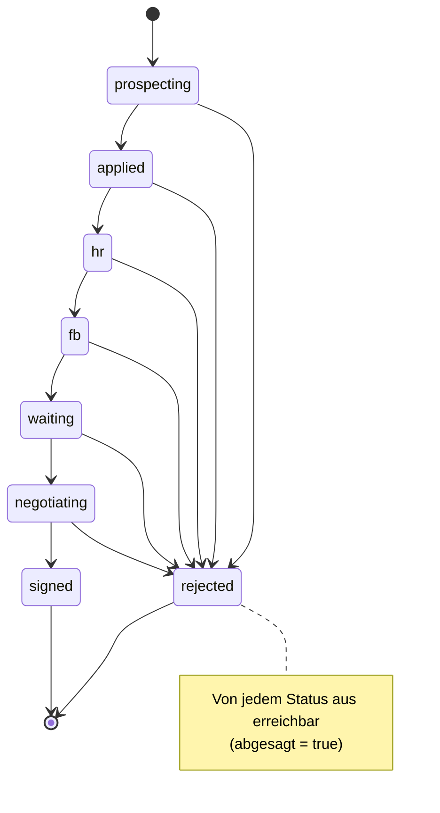
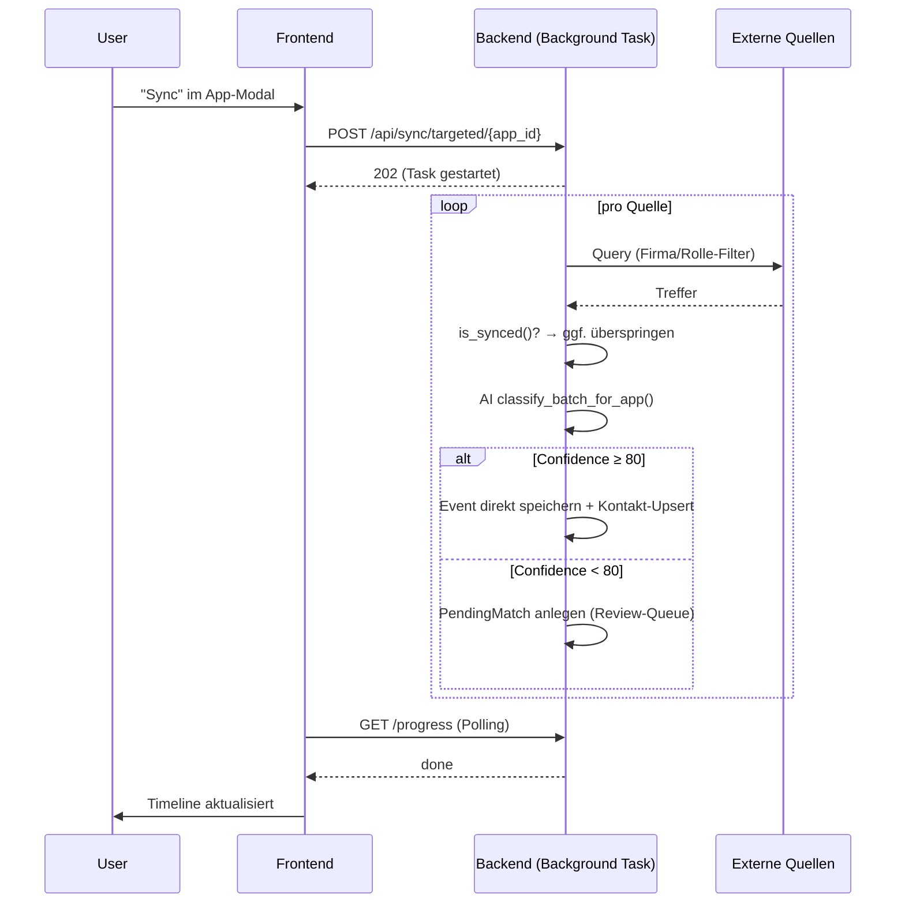
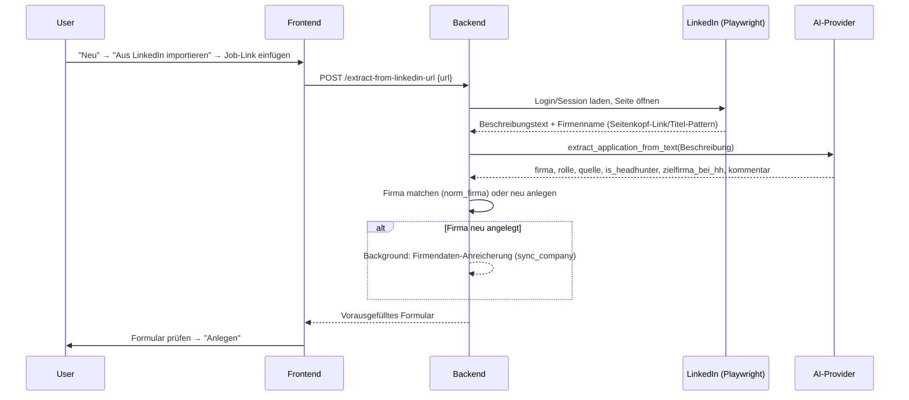
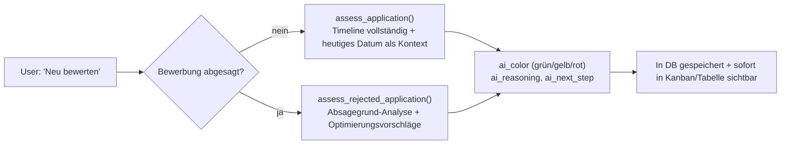
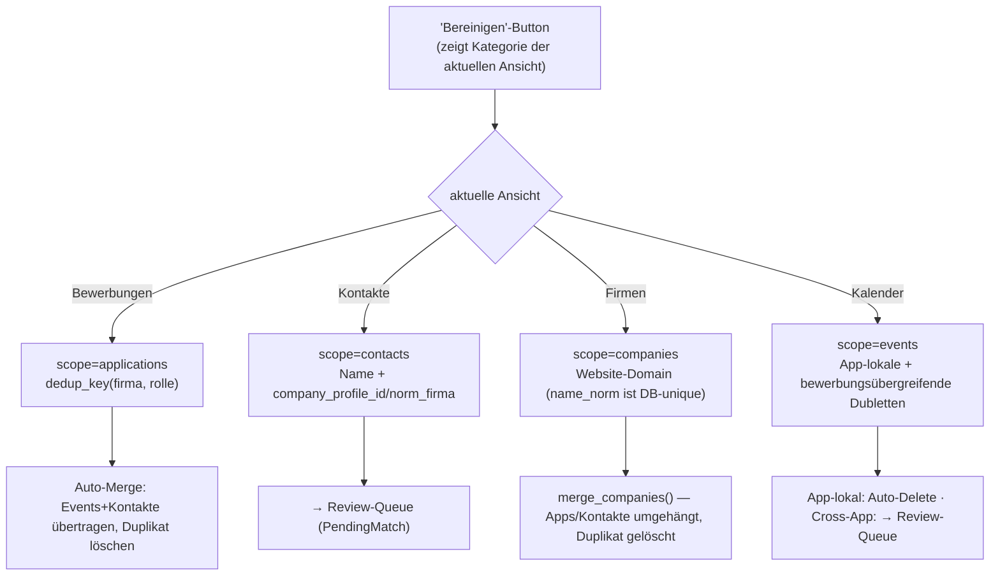
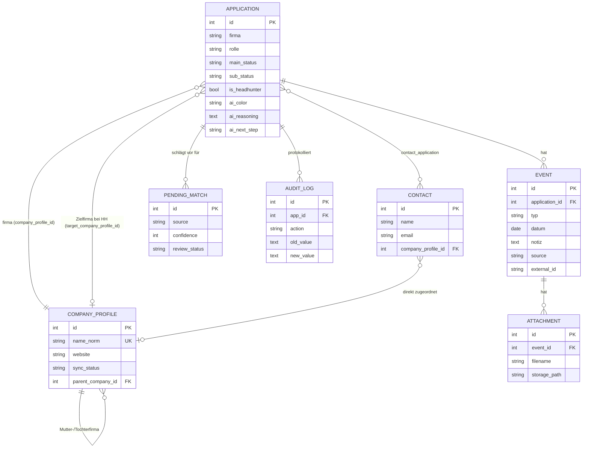
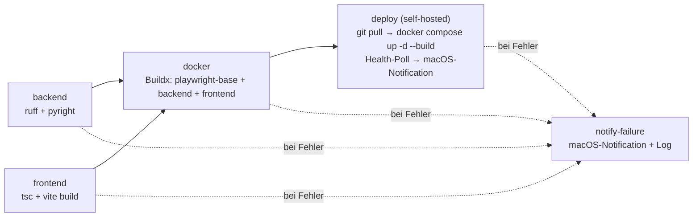

# rapport – Technische Architektur

> Dieses Dokument beschreibt die **aktuelle Implementierung** (Stand v3.33.1, 2026-07-05). Das ursprüngliche Planungsdokument mit Vision und Roadmap: [Rapport_Konzept_Architektur.md](Rapport_Konzept_Architektur.md)
>
> Diagramme sind als [Mermaid](https://mermaid.js.org/) eingebettet — GitHub rendert sie automatisch beim Anzeigen der Datei. Kein externes Tool zum Betrachten nötig; zum Bearbeiten reicht ein Texteditor.

## Inhaltsverzeichnis

1. [System- und SW-Architektur](#1-system--und-sw-architektur)
2. [API-Schnittstellen (intern)](#2-api-schnittstellen-intern)
3. [Externe Schnittstellen (Sync-Quellen)](#3-externe-schnittstellen-sync-quellen)
4. [Statusübergänge](#4-statusübergänge)
5. [Workflows](#5-workflows)
6. [Datenmodell](#6-datenmodell)
7. [CI/CD](#7-cicd)

---

## 1. System- und SW-Architektur

### Überblick


### Technologie-Stack

| Schicht | Technologie | Version |
|---|---|---|
| Frontend-Framework | React | 18 |
| Frontend-Sprache | TypeScript | 5 |
| Frontend-Styles | Tailwind CSS | 3 |
| Frontend-Build | Vite | 5 |
| Frontend-Serving | nginx (Alpine) | stable |
| Backend-Framework | FastAPI | 0.110+ |
| Backend-Sprache | Python | 3.11 |
| Backend-Server | uvicorn | 0.29+ |
| ORM | SQLAlchemy | 2.0 |
| Datenbank | SQLite (WAL-Modus) | 3 |
| Kryptographie | cryptography (Fernet) | 42+ |
| AI-Klassifikation | litellm (Provider-unabhängig) | latest |
| Excel-Import/Export | openpyxl | 3.1+ |
| PDF-Export | fpdf2 | 2.8+ |
| LinkedIn-Scraper / Job-Import | Playwright | latest |
| Logging | Loguru → Seq (CLEF) | – |
| Containerisierung | Docker Compose | v2 |

### Container-Konfiguration

**`docker-compose.yml`** definiert drei Services:

| Service | Image / Build | Port | Volume | Static IP |
|---|---|---|---|---|
| `backend` | `./backend` Dockerfile | `8000:8000` | `jobtracker-data:/app/data` | `192.168.117.10` |
| `frontend` | `./frontend` Dockerfile (Build-Arg `BUILD_NUMBER`) | `3000:80` | – | `192.168.117.11` |
| `seq` | `datalust/seq:latest` | `8088:80`, `5341:5341` | `seq-data:/data` | `192.168.117.13` |

Beide App-Container erhalten `TZ=Europe/Berlin`. Backend zusätzlich `SEQ_URL=http://seq:5341` und `LOG_LEVEL=INFO`.

Das SQLite-File liegt im benannten Volume `jobtracker-data` unter `/app/data/jobtracker.db`. Das Schema wird beim Start via SQLAlchemy `create_all()` plus additive Inline-Migrationen in `database.py` angelegt/erweitert — kein Alembic.

### Projektstruktur (Backend)

```
backend/app/
├── main.py                  FastAPI-App, CORS, Lifespan, Router-Registrierung
├── database.py               SQLAlchemy-Engine + SessionLocal + get_db + Inline-Migrationen
├── models.py                  ORM-Modelle, Status-Enums, Excel-Mapping-Konstanten
├── schemas.py                 Pydantic Request/Response-Schemas
├── audit.py                   add_audit() – Audit-Log-Helper (Level: off/normal/verbose)
├── dedup.py                   norm_firma()/norm_rolle()/dedup_key() – Normalisierung für Dublettenerkennung
├── logger.py                  Loguru-Setup, JSON-Log + Seq-Sink (CLEF)
├── linkedin_job_description.py  Job-Beschreibung + Firmenname von LinkedIn-URL laden (Playwright)
├── ai/
│   ├── provider.py          litellm-Wrapper, Fernet-Kryptographie, AINotConfigured/AIRateLimited/AIBadRequest
│   └── tasks.py              Klassifikations-/Bewertungs-/Extraktions-Prompts (assess_application, extract_application_from_text, match_and_classify, …)
└── routers/
    ├── applications.py       CRUD + Events + Contacts + KI-Bewertung + LinkedIn-Import
    ├── contacts.py            Globale Kontaktverwaltung
    ├── companies.py           Firmenprofile: CRUD, Logo, Kontakt-Verknüpfung
    ├── merge.py                Bewerbungen/Firmen/Kontakte zusammenführen
    ├── cleanup.py              Dublettenerkennung + -bereinigung (scope-fähig)
    ├── import_excel.py        POST /api/import/excel
    ├── export_excel.py        GET /api/export/excel
    ├── export_pdf.py           GET /api/export/pdf
    ├── attachments.py          Datei-Anhänge an Timeline-Events
    ├── settings.py             AI-Settings, Logo-API-Key, Sync-Toggles, Ollama-Modelle
    ├── geo.py                   Ortsautocomplete (Google Places, Fallback Nominatim)
    ├── calendar.py             GET /api/calendar/events
    ├── analytics.py            Pipeline-Funnel- und Absage-Statistiken
    ├── audit_log.py            Audit-Trail lesen/löschen
    ├── backup.py                Lokale DB-Backups konfigurieren/ausführen
    ├── sync_common.py          Shared Helpers: Dedup, AI-Klassifikation, Kontakt-Upsert
    ├── sync_google.py          Google OAuth + Gmail + GCal
    ├── sync_icloud.py          iCloud Mail/Kalender/Notizen/Erinnerungen/Kontakte/Anrufe
    ├── sync_targeted.py        Pro-App-Sync über alle Quellen + manuelle Kandidatenzuordnung
    ├── sync_files.py            Lokale Dokumente via Rapport Agent (Port 9996)
    ├── sync_linkedin.py         LinkedIn-Playwright-Scraper (eigene Bewerbungen) mit 2FA-Inline
    ├── sync_company.py          Firmendaten-Anreicherung (DuckDuckGo → Wikipedia → Clearbit-Logo)
    ├── review.py                Manuelle Review-Queue (PendingMatches)
    └── startup_check.py        Health-/Bridge-Konnektivitätscheck
```

### Projektstruktur (Frontend)

```
frontend/src/
├── App.tsx                 Root-Komponente: Tabs (Bewerbungen/Kontakte/Firmen/Kalender/Auswertungen), Toolbar, Modal-Orchestrierung
├── types.ts                 TypeScript-Typen, Status-Labels/Farben, Konstanten
├── api/client.ts             Fetch-Wrapper für alle Backend-Calls, gruppiert nach Namespace
└── components/
    ├── ApplicationTable.tsx    Sortierbare Tabellenansicht
    ├── KanbanBoard.tsx          Kanban mit Drag & Drop
    ├── ApplicationModal.tsx     Detail/Edit-Modal: Lifecycle-Bar, Timeline, Anhänge, Kontakte, KI-Bewertung
    ├── CalendarView.tsx          Kalender-Ansicht (Tag/Woche/Monat)
    ├── StatsBar.tsx               KPI-Kacheln
    ├── StatusBadge.tsx            Farbige Status-Badges
    ├── StatusPopover.tsx          Inline-Statuswechsel
    ├── ContactsView.tsx            Kontaktübersicht
    ├── ContactModal.tsx            Kontakt-Detail/Edit
    ├── CompaniesView.tsx            Firmenübersicht (Markierung → gescopter Sync/Merge/Bereinigen)
    ├── CompanyModal.tsx              Firmenprofil-Detail/Edit
    ├── CompanyLogo.tsx                Firmenlogo mit Fallback
    ├── CompanyFilterPicker.tsx        Firmenfilter-Autocomplete
    ├── MergeDialog.tsx                 AppMergeDialog / CompanyMergeDialog / ContactMergeDialog
    ├── CleanupModal.tsx                 Dubletten-Bereinigung, kontextsensitiv (scope-Prop)
    ├── ReviewModal.tsx                   Review-Inbox für KI-/Sync-Vorschläge
    ├── SettingsModal.tsx                  Einstellungen (Tabs: Sync/KI/Google/iCloud/Anrufe/Dokumente/LinkedIn/Backup/Logos/Karten/Agent)
    ├── SyncButton.tsx                      Globaler Sync-Trigger + Fortschrittsanzeige
    ├── ImportButton.tsx / ExportButton.tsx / PdfExportButton.tsx / ImportExportMenu.tsx
    ├── AuditLogModal.tsx                   Audit-Trail-Ansicht
    ├── AnalyticsView.tsx                    Funnel-/Conversion-Dashboard
    ├── ChangelogModal.tsx                   Versionsverlauf (CURRENT_VERSION hier gepflegt)
    └── StartupWarningBanner.tsx             Warnbanner bei Bridge-/Verbindungsproblemen
```

---

## 2. API-Schnittstellen (intern)

Swagger UI: `http://localhost:8000/docs`

### Bewerbungen

| Methode | Pfad | Beschreibung |
|---|---|---|
| `GET` | `/api/applications/` | Liste (Filter: `main_status`, `search`, `show_rejected`) |
| `GET` | `/api/applications/stats` | KPI-Zahlen |
| `GET` | `/api/applications/ai-assess-all` | KI-Bewertung aller aktiven Bewerbungen (SSE-Stream mit Fortschritt) |
| `POST` | `/api/applications/extract-from-linkedin-url` | Stellenanzeige von LinkedIn-URL laden, Felder per KI extrahieren + Firma matchen/anlegen |
| `GET` | `/api/applications/{id}` | Detail mit Events + Contacts |
| `POST` | `/api/applications/` | Neu anlegen (erstellt automatisch Event `bewerbung`) |
| `PATCH` | `/api/applications/{id}` | Felder aktualisieren (erstellt Event bei Statuswechsel) |
| `DELETE` | `/api/applications/{id}` | Löschen (kaskadiert Events + contact_application) |
| `POST` | `/api/applications/{id}/ai-assess` | Einzelbewertung (Erfolgschance grün/gelb/rot + Begründung + nächster Schritt) |

### Events (Timeline) & Kontakte (pro Bewerbung)

| Methode | Pfad | Beschreibung |
|---|---|---|
| `GET`/`POST` | `/api/applications/{id}/events` | Timeline lesen / Event manuell hinzufügen |
| `PATCH`/`DELETE` | `/api/applications/{id}/events/{eid}` | Event bearbeiten / löschen |
| `GET`/`POST` | `/api/applications/{id}/contacts` | Kontakte der Bewerbung / anlegen+verknüpfen |
| `PATCH`/`PUT`/`DELETE` | `/api/applications/{id}/contacts/{cid}` | Kontakt bearbeiten / Verknüpfung entfernen |

### Kontakte (global) & Anhänge

| Methode | Pfad | Beschreibung |
|---|---|---|
| `GET`/`POST` | `/api/contacts/` | Alle Kontakte / anlegen |
| `PATCH` | `/api/contacts/{id}` | Bearbeiten |
| `DELETE` | `/api/contacts/bulk` | Mehrere löschen |
| `POST` | `/api/attachments/{event_id}/upload` | Datei an Event anhängen |
| `GET` | `/api/attachments/{id}/download` | Anhang herunterladen |
| `DELETE` | `/api/attachments/{id}` | Anhang löschen |

### Firmen

| Methode | Pfad | Beschreibung |
|---|---|---|
| `GET`/`POST` | `/api/companies` | Liste / anlegen |
| `GET`/`PATCH` | `/api/companies/{id}` | Detail / bearbeiten |
| `POST`/`DELETE` | `/api/companies/{id}/logo` | Logo hochladen / löschen |
| `POST`/`DELETE` | `/api/companies/{id}/contacts/{cid}` | Kontakt zuordnen / entfernen |
| `DELETE` | `/api/companies/bulk` | Mehrere löschen |
| `POST` | `/api/companies/link-contacts` | Verwaiste Kontakte anhand Firmenname automatisch verknüpfen (`?company_ids=` optional) |
| `GET`/`POST` | `/api/companies/link-contacts/status` \| `/cancel` | Fortschritt / Abbrechen |
| `GET`/`POST` | `/api/sync/company/status` \| `/run` | Firmendaten-Anreicherung: Status / Start (`?force=&company_ids=` optional) |
| `POST` | `/api/sync/company/cancel` \| `/reset-lock` \| `/reset-failed` | Steuerung |

### Zusammenführen & Bereinigen

| Methode | Pfad | Beschreibung |
|---|---|---|
| `POST` | `/api/merge/applications` \| `/companies` \| `/contacts` | Zwei oder mehr Duplikate zu einem zusammenführen |
| `GET` | `/api/cleanup/preview` | Gefundene Dubletten, optional `?scope=applications\|contacts\|companies\|events` |
| `POST` | `/api/cleanup/run` | Bereinigung ausführen (gleicher `scope`-Parameter) |
| `GET` | `/api/cleanup/progress` | Fortschritt |

### Import / Export

| Methode | Pfad | Beschreibung |
|---|---|---|
| `POST` | `/api/import/excel` | Excel-Upload (Sheet "Tracking") |
| `GET` | `/api/export/excel` | Excel-Download (`?show_rejected=true` optional) |
| `GET` | `/api/export/pdf` | PDF-Export der Eigenbemühungen |

### Sync – Google / iCloud / Targeted / LinkedIn / Dateien

| Methode | Pfad | Beschreibung |
|---|---|---|
| `POST`/`GET`/`DELETE` | `/api/sync/google/*` | OAuth-Credentials, Status, Gmail-/GCal-Sync |
| `POST`/`GET`/`DELETE` | `/api/sync/icloud/*` | Mail/Kalender/Notizen/Erinnerungen/Kontakte/Anrufe |
| `POST` | `/api/sync/targeted/{app_id}` | Alle Quellen für eine Bewerbung synchronisieren |
| `GET` | `/api/sync/targeted/{app_id}/candidates` | Kandidaten für manuelle Zuordnung (Volltextsuche über alle Quellen) |
| `POST` | `/api/sync/targeted/{app_id}/assign` | Kandidat manuell zuordnen |
| `GET`/`POST`/`DELETE` | `/api/sync/linkedin/*` | LinkedIn-Login, Session, Scraper-Start, 2FA |
| `GET`/`POST` | `/api/sync/linkedin/people/search` \| `/people/import` | Manueller Kontakt-Import: LinkedIn-Personensuche → Auswahl importieren |
| `GET`/`POST` | `/api/sync/icloud/contacts/search` \| `/contacts/import` | Manueller Kontakt-Import: volltextsuche im iCloud-Adressbuch → Auswahl importieren |
| `GET`/`POST` | `/api/sync/files/*` | Lokale Dokumente (Rapport Agent) |

### Kalender, Review, Analytics, Audit, Backup, Einstellungen

| Methode | Pfad | Beschreibung |
|---|---|---|
| `GET` | `/api/calendar/events` | Alle Kalender-Events (`?start=&end=`) |
| `GET`/`POST`/`DELETE` | `/api/review/*` | Review-Queue für KI-/Sync-Vorschläge |
| `GET` | `/api/analytics/summary` | Pipeline-Funnel + Absage-Statistiken |
| `GET`/`DELETE` | `/api/audit/` | Audit-Trail lesen / löschen |
| `GET`/`POST` | `/api/backup/*` | Backup-Konfiguration, manueller Lauf, Restore |
| `GET`/`POST`/`DELETE` | `/api/settings/*` | KI-Provider, Logo-Key, Sync-Toggles, Dokumente-Ordner, Agent-URL/Token, Karten-API-Key |
| `GET` | `/api/startup-check` | Health-/Bridge-Konnektivitätscheck |
| `GET` | `/api/geo/search` | Ortsautocomplete (Google Places, Fallback Nominatim) |
| `GET` | `/health` | Health-Check |

---

## 3. Externe Schnittstellen (Sync-Quellen)

### 3.1 Gmail API (Google OAuth 2.0)

- **Protokoll:** REST, `google-auth` + `google-api-python-client`
- **OAuth-Flow:** Authorization Code Flow; Redirect URI `http://localhost:8000/api/sync/google/callback`
- **Tokens:** Fernet-verschlüsselt in `google_sync.access_token_enc` / `refresh_token_enc`
- **Dedup:** `synced_items` mit `source="gmail"` und Gmail-Message-ID

### 3.2 Google Calendar API

- **Sync-Strategie:** Events aus allen Kalendern; Firma/Rolle als Suchbegriff
- **Änderungserkennung:** Verschobene/umbenannte Events werden bei erneutem Sync aktualisiert; nicht mehr vorhandene Events (nicht mehr im `uid_set` des Sync-Fensters) werden lokal gelöscht — externer Kalender hat immer Vorrang
- **Kontakt-Extraktion:** Teilnehmer via `upsert_contact_from_sender`

### 3.3 iCloud Mail (IMAP) / Kalender (CalDAV) / Kontakte (CardDAV)

- **Mail:** `imap.mail.me.com:993`, App-Specific Password (Fernet-verschlüsselt)
- **Kalender:** `caldav.icloud.com`, `vobject` für VCALENDAR-Parsing, gleiche Änderungserkennung wie GCal
- **Kontakte/Notizen/Erinnerungen/Anrufe:** ergänzend synchronisierbar, je über eigene Toggles in `sync_settings`
- **Manueller Kontakt-Import:** Volltextsuche im gesamten CardDAV-Adressbuch aus der Kontakte-Übersicht heraus (unabhängig vom automatischen Sync), bereits importierte Treffer werden markiert statt ausgeblendet

### 3.4 LinkedIn (Playwright)

Zwei getrennte Anwendungsfälle, beide über Headless Chromium:

1. **Eigene Bewerbungsaktivität synchronisieren** (`sync_linkedin.py`) — scraped die "Meine Jobs"-Kategorien des angemeldeten Accounts: SAVED, DRAFT + CLICKED_APPLY (beide → `prospecting`; LinkedIns Sammel-Tab "In Progress" ist nur eine Client-Ansicht dieser beiden echten Unterkategorien, je mit eigener, sonst nicht URL-adressierbarer Ansicht), APPLIED, INTERVIEWS, ARCHIVED
2. **Einzelne Stellenanzeige importieren** (`linkedin_job_description.py`) — lädt eine konkrete `/jobs/view/`-URL, extrahiert Beschreibungstext (Tree-Walker-Heuristik, robust gegen LinkedIns gehashte CSS-Klassennamen) sowie den anzeigenschaltenden Firmennamen (Link zur Firmenseite im Anzeigenkopf + `document.title`-Pattern als Fallback — ebenfalls klassenname-unabhängig)

Beide nutzen dieselben Login-/2FA-/Consent-Helper. Session-Cookies werden in `linkedin_sync.session_cookies` gecacht.

3. **Personen manuell importieren** (`people/search`, `people/import`) — Namenssuche über LinkedINs People-Search (text-basierte Card-Extraktion statt CSS-Selektoren, robust gegen gehashte Klassennamen), Auswahl als Kontakt anlegen

### 3.5 Lokale Dokumente, Notizen & Anrufe (Rapport Agent)

- **`agent/`** (Port 9996, läuft auf dem Mac als `.app`/`launchd`-Dienst, nicht in Docker) — ein einzelner Prozess ersetzt die früheren drei separaten Bridge-Skripte (`files_bridge.py`, `notes_bridge.py`, `calls_bridge.py`), mit Bearer-Token-Auth statt offener Ports
- **Dateien-Modul** — liefert Dateiinhalte aus konfiguriertem Ordner, native Ordner-/Datei-Picker, Backup-Lesen/Schreiben
- **Notizen-Modul** — iCloud-Notizen via AppleScript (JXA)
- **Anrufe-Modul** — iPhone-Anrufliste (CallHistoryDB) + WhatsApp via AppleScript/SQLite
- **Architektur:** OS-neutrale Provider-Interfaces (`agent/providers/base.py`) mit heute nur einer macOS-Implementierung — bewusst so angelegt, um später einen Windows-Adapter hinter derselben Schnittstelle nachzuziehen, ohne Backend/Frontend anzufassen

### 3.6 AI-Klassifikation & -Bewertung (litellm)

- **Provider:** Konfigurierbar — Groq (Standard, kostenlos), Anthropic, OpenAI, Ollama (lokal)
- **Anwendungsfälle** (`ai/tasks.py`):
  - `match_and_classify()` — Rohdaten (Mail/Kalender/Notiz) einer Bewerbung zuordnen, Event-Typ bestimmen
  - `assess_application()` / `assess_rejected_application()` — Erfolgschance (grün/gelb/rot) inkl. Begründung und nächstem Schritt; bei Absagen stattdessen Absagegrund-Analyse
  - `extract_application_from_text()` — Firma/Rolle/Quelle/Headhunter-Flag aus Stellenanzeigen-Text extrahieren (LinkedIn-Import)
- **Fallback:** Bei `AINotConfigured` / `AIRateLimited` / `AIBadRequest` wird sauber degradiert statt zu crashen

### 3.7 Firmendaten-Anreicherung (`sync_company.py`)

- **Quellen-Kaskade:** LinkedIn-Firmenseite (primär, Playwright — Branche/Standort/Mitarbeiterzahl/Logo) → Wikidata-Fallback (Search API + batch SPARQL, bei 0 LinkedIn-Treffern oder manuell als "keiner davon" aufgelöst) → Clearbit (Logo-Fallback über Domain, falls weder LinkedIn noch Wikidata ein Logo liefern)
- **Disambiguierung:** Bei mehreren LinkedIn-Treffern landet die Firma als `pending` mit Kandidatenliste in der Review-Queue; manuelle Wahl inkl. "keiner davon" (→ Wikidata-Fallback für genau dieses eine Profil)
- **Trigger:** Manuell über "Sync"/"Re-Sync" in der Firmenansicht (optional auf Markierung beschränkt), automatisch einmalig bei Neuanlage über LinkedIn-Import

---

## 4. Statusübergänge

### 4.1 Main-Status Pipeline



| Status | Bedeutung |
|---|---|
| `prospecting` | Anbahnung — Stelle identifiziert, noch nicht beworben |
| `applied` | Beworben |
| `hr` | Gespräch HR/HH |
| `fb` | Gespräch Fachbereich |
| `waiting` | Warten auf Entscheidung |
| `negotiating` | Angebotsverhandlung |
| `signed` | Unterschrift |
| `rejected` | Absage |

**Wichtig:** Die Kanban-Lifecycle-Bar zeigt die 7 Hauptschritte + separate Absage-Node (`MAIN_PIPELINE` im Frontend enthält `rejected` bewusst nicht). Backend-seitig ist `rejected` in `PIPELINE_ORDER` als achte, letzte Stufe geführt (relevant für Sync-Statusvergleiche).

### 4.2 Sub-Status (nur bei `hr` und `fb`)

`1_scheduled → 1_done → 2_scheduled → 2_done → … → 5_done` — Gesprächsrunden-Tracking. Beim Wechsel zu einem Status ohne Sub-Status wird `sub_status` automatisch auf `null` gesetzt.

### 4.3 Statuswechsel-Regeln (Backend `applications.py`)

```
PATCH /api/applications/{id}
  main_status → rejected    ⟹  abgesagt = True  (auto)
  main_status → ≠rejected   ⟹  abgesagt = False (auto, wenn nicht explizit gesetzt)
  main_status → ≠{hr, fb}   ⟹  sub_status = None (auto)
  Statuswechsel             ⟹  Event typ="status" wird automatisch angelegt
```

---

## 5. Workflows

### 5.1 Targeted Sync (Pro-Bewerbung)



### 5.2 LinkedIn-Import einer Stellenanzeige



### 5.3 KI-Bewertung (Erfolgschance)



Batch-Lauf ("KI bewerten" im Header) verarbeitet alle aktiven Bewerbungen nacheinander per Server-Sent-Events-Stream mit Live-Fortschrittsanzeige, überspringt abgesagte Bewerbungen, throttelt bei Groq/Gemini (Rate-Limits) automatisch.

### 5.4 Dubletten-Bereinigung (kontextsensitiv)



### 5.5 Weitere Workflows (kurz)

- **Manuelle Bewerbung anlegen** — `POST /api/applications/` → Event `typ="bewerbung"` automatisch mitangelegt
- **Excel-Import/-Export** — `openpyxl`, Sheet "Tracking", 17 Spalten, Status-Mapping über `EXCEL_IMPORT_MAP`/`EXCEL_EXPORT_MAP`
- **Kontakt-Upsert aus Sync** — `upsert_contact_from_sender()`: E-Mail-Adresse als Dedup-Schlüssel, Footer-Extraktion für Telefon/Rolle, `INSERT OR IGNORE` statt ORM-`append()` (vermeidet Autoflush-Races)
- **`naechster_schritt`-Berechnung** — nicht in DB gespeichert, pro `GET /api/applications/`-Request aus Timeline-Events + Status abgeleitet
- **Review-Queue** — Items mit KI-Konfidenz < 80 landen in `pending_matches`; User bestätigt (→ Event/Statuswechsel) oder verwirft

---

## 6. Datenmodell

### Entity-Relationship-Übersicht



**Singleton-Konfigurationstabellen** (genau eine Zeile pro Installation, keine ER-Relationen): `google_sync`, `icloud_sync`, `linkedin_sync`, `ai_settings`, `sync_settings`, `calls_config`, `files_config`, `agent_settings`, `maps_settings`, `backup_config`, `logo_settings`.

**Weitere Tabellen ohne direkte FK-Relation:** `synced_items` (Dedup-Ledger über alle Sync-Quellen), `merge_aliases` (behält alte Kennungen zusammengeführter Bewerbungen/Kontakte, damit künftige Syncs weiterhin auf den kanonischen Datensatz auflösen).

### Tabellen im Detail

#### `applications`

| Spalte | Typ | Beschreibung |
|---|---|---|
| `firma`, `rolle` | VARCHAR NOT NULL | |
| `main_status` / `sub_status` | VARCHAR | Siehe [Statusübergänge](#4-statusübergänge) |
| `is_headhunter` / `zielfirma_bei_hh` | BOOLEAN / VARCHAR | |
| `quelle`, `wurde_besetzt_von` | VARCHAR NULL | |
| `datum_bewerbung`, `letztes_update` | DATE NULL | `letztes_update` wird bei Abfrage in-memory durch `max(events.datum ≤ today)` überschrieben, falls größer |
| `linkedin_job_id`, `stellenanzeige_url` | VARCHAR NULL | Für LinkedIn-Sync-Matching bzw. Import-Herkunft |
| `company_profile_id` / `target_company_profile_id` | INTEGER FK | → `company_profiles.id` |
| `ai_color` / `ai_reasoning` / `ai_next_step` / `ai_assessed_at` | VARCHAR/TEXT/VARCHAR/DATETIME | KI-Bewertung |
| `gespraech_1`…`5` | TEXT NULL | Notizen (Excel-Import-Erbe) |
| `abgesagt` (Property) | — | Berechnet aus `main_status == "rejected"` |
| `ghosting` (Property) | — | Berechnet: > 14 Tage keine Aktivität |

#### `events`

| Spalte | Typ | Beschreibung |
|---|---|---|
| `application_id` | INTEGER FK NOT NULL | → `applications.id` |
| `typ` | VARCHAR | `bewerbung`, `status`, `gespräch`, `mail`, `calendar`, `call`, `notiz` |
| `datum`, `titel`, `notiz`, `autor` | | |
| `source` | VARCHAR | `gmail`, `gcal`, `icloud_mail`, `icloud_cal`, `calls`, `linkedin` |
| `external_id` | VARCHAR NULL | Dedup- und Deep-Link-Schlüssel |

#### `attachments`

| Spalte | Typ | Beschreibung |
|---|---|---|
| `event_id` | INTEGER FK NOT NULL, CASCADE | → `events.id` |
| `filename`, `content_type`, `size_bytes` | | |
| `storage_path` | VARCHAR | relativ zu `/app/data/attachments/` |
| `source`, `external_id` | VARCHAR NULL | |

#### `contacts` / `contact_application`

| Spalte | Typ | Beschreibung |
|---|---|---|
| `name`, `vorname`, `email`, `telefon`, `linkedin_url` | | |
| `firma`, `rolle`, `typ` | | `typ`: `hr`, `hh`, `fb`, `other` |
| `company_profile_id` | INTEGER FK NULL | → `company_profiles.id` |
| `letzter_kontakt` | DATE NULL | |

`contact_application` (Join-Tabelle, `contact_id`+`application_id` PK/FK, CASCADE) — Inserts via `INSERT OR IGNORE` (Raw-SQL statt ORM-`append()`, vermeidet Autoflush-Races).

#### `company_profiles`

| Spalte | Typ | Beschreibung |
|---|---|---|
| `name_norm` | VARCHAR UNIQUE, indexed | Normalisierter Name (`norm_firma()`) — **Dedup-Schlüssel bei Anlage**, daher können auf Namensebene keine Dubletten entstehen. Reale Dubletten (abweichende Schreibweise) werden stattdessen über die Website-Domain erkannt (`cleanup.py`) |
| `name_display`, `website`, `linkedin_company_url` | | |
| `hq_city`, `hq_country`, `industry`, `company_type` | | |
| `employee_range`, `employee_count`, `founded_year` | | |
| `description`, `logo_data` | TEXT | Von `sync_company.py` befüllt |
| `sync_status` / `sync_error` / `sync_source` / `last_synced_at` | | `pending` \| `done` \| `failed` |
| `parent_company_id` | INTEGER FK NULL, self-referential | Mutter-/Tochterfirma |

#### `pending_matches` (Review-Queue)

| Spalte | Typ | Beschreibung |
|---|---|---|
| `source`, `external_id`, `confidence` (0–100) | | |
| `event_type`, `datum`, `titel`, `extract`, `raw_content` | | |
| `suggested_app_id` | INTEGER FK NULL | → `applications.id` |
| `suggested_main_status` / `suggested_sub_status` | | |
| `status_only` | BOOLEAN | True = nur Statuswechsel, kein neues Event |
| `review_status` | VARCHAR | `pending`, `approved`, `rejected` |

#### `audit_log`

| Spalte | Typ | Beschreibung |
|---|---|---|
| `app_id` | INTEGER FK NULL, ON DELETE SET NULL, indexed | → `applications.id` |
| `action` | VARCHAR | `create`, `update`, `delete`, `status_change`, `merge`, `import` |
| `field`, `old_value`, `new_value`, `reason` | | |
| `source` | VARCHAR | Default `"user"` |

Verbosity über `sync_settings.audit_log_level` steuerbar (`off`/`normal`/`verbose`).

#### `synced_items` (Dedup-Ledger)

`source` + `external_id` (Message-ID / Event-UID / MD5-Hash) — `SELECT 1 FROM synced_items WHERE source=? AND external_id=?` als Dedup-Check vor jedem Sync-Item.

#### `merge_aliases`

`entity_type` (`application`|`contact`), `canonical_id`, plus die ursprünglichen Kennungen (`alias_firma`, `alias_rolle`, `alias_li_job_id`, `alias_name`, `alias_email`) — damit ein zusammengeführter Datensatz bei künftigen Syncs weiterhin über seine alte Kennung gefunden wird.

#### Singleton-Konfigurationstabellen

| Tabelle | Zweck | Sensible Felder (Fernet-verschlüsselt) |
|---|---|---|
| `google_sync` | OAuth-Client + Tokens, letzte Sync-Zeiten | `client_secret_enc`, `access_token_enc`, `refresh_token_enc` |
| `icloud_sync` | Apple-ID + App-Passwort, Sync-Zeiten pro Feature | `app_password_enc`, `web_password_enc` |
| `linkedin_sync` | LinkedIn-Login + Session-Cookies | `password_enc` |
| `ai_settings` | KI-Provider/Modell/Key | `api_key_enc` |
| `sync_settings` | Enable-Toggles pro Quelle + Audit-Log-Level | – |
| `calls_config` / `files_config` | Bridge-Konfiguration | – |
| `agent_settings` | Rapport-Agent-URL (Override) + Token | `token_enc` |
| `maps_settings` | Google Places API-Key (Ortsautocomplete, Fallback Nominatim) | `api_key_enc` |
| `backup_config` | Backup-Ordner, Frequenz, Aufbewahrung | – |
| `logo_settings` | Logo.dev API-Key | – |

### Kryptographie

Alle sensitiven Felder (Passwörter, OAuth-Tokens, API-Keys) werden mit **Fernet** (symmetrische AEAD-Verschlüsselung, `cryptography`-Bibliothek) verschlüsselt. Schlüssel liegt in `backend/data/fernet.key` im Docker-Volume (nie committen), wird beim ersten Start automatisch generiert.

Funktionen in `app/ai/provider.py`: `encrypt_api_key()` / `decrypt_api_key()`.

---

## 7. CI/CD

Datei: `.github/workflows/ci.yml` · Self-hosted Runner auf dem Mac.



| Job | Trigger | Schritte |
|---|---|---|
| `backend` | Push/PR auf `main` | `ruff check` (E,F,W), `pyright` (informational, continue-on-error) |
| `frontend` | Push/PR auf `main` | `tsc --noEmit`, `vite build` |
| `docker` | Push auf `main` (nach backend+frontend) | Buildx: `Dockerfile.playwright-base`, Backend-, Frontend-Image (kein Push in Registry) |
| `deploy` | Push auf `main` (self-hosted, nach docker) | `git pull` → Playwright-Base bei Bedarf neu bauen (Hash-Check) → `docker compose up -d --build` → Health-Poll `/health` (60s) → macOS-Notification + Browser öffnen |
| `notify-failure` | `always()` bei Fehler in einem der obigen Jobs | macOS-Fehlerbenachrichtigung + Log-Eintrag |

Repository: [github.com/EGulinsky/rapport](https://github.com/EGulinsky/rapport) (privat)
