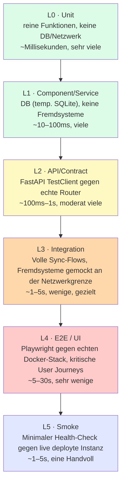
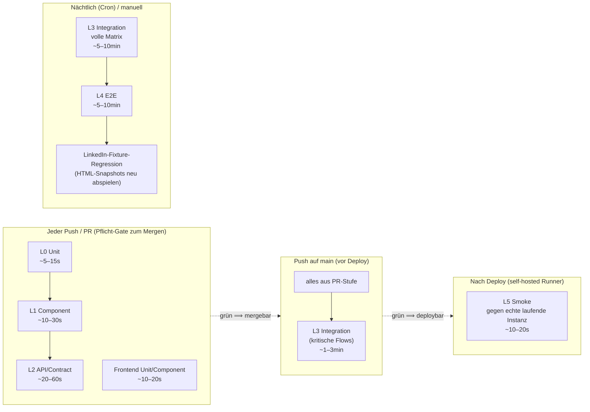

# rapport – Testkonzept

> Status: **Phase 1–3 umgesetzt, Phase 4 in Arbeit** (siehe Rollout-Plan, Abschnitt 11) — PR-Gate mit L0/L1/L2-Tests läuft in CI (jetzt inkl. LinkedIn-Statuslogik), L3-Integrationstests (KI-Provider, Google Calendar, Gmail) laufen bei Push auf `main`. iCloud-Mocking und LinkedIn-Playwright-Fixture-Replay sowie Phase 5–6 (E2E-Suite, Nightly-Job) stehen noch aus. Die in Abschnitt 12 aufgeführten Entscheidungen bleiben verbindliche Leitplanken für die weitere Umsetzung.

## 0. Ausgangslage (Stand bei Konzepterstellung, 2026-07-01)

Zum Zeitpunkt dieses Konzepts existierte **keine** automatisierte Testabdeckung. Die CI-Pipeline (`ci.yml`) prüfte nur:
- Backend: `ruff` (Lint) + `pyright` (informativ, `continue-on-error`)
- Frontend: `tsc --noEmit` + `vite build`
- Docker-Buildbarkeit

Es gab einen einzelnen Standalone-Script (`backend/test_linkedin_extraction.py`), der LinkedIn-Scraping-JS gegen manuell erfasste HTML-Dateien testet — kein Test-Runner, kein CI-Anschluss, aber ein brauchbares Muster (Fixture-Replay statt Live-Scraping). Dieses Skript existiert weiterhin unverändert als eigenständiges Debug-Tool (nicht Teil der formalen Suite unten).

**Aktueller Stand (364 Tests insgesamt, Stand 2026-07-06):** `backend/tests/` (280 Tests, Marker `unit`/`component`/`api`), `agent/tests/` (51 Tests) und `frontend/src/**/*.test.tsx` (11 Tests) laufen bei jedem Push als Pflicht-Gate (siehe `ci.yml`). Zusätzlich laufen bei Push auf `main` 22 L3-Integrationstests (`pytest -m integration`: KI-Provider-Flow über `fake_ai_provider`, Google-Calendar-Sync über `fake_google_calendar`, Gmail-Sync inkl. zweiphasiger Batch-Abholung über `fake_gmail`). iCloud (IMAP/CalDAV/CardDAV), LinkedIn-Playwright-Fixture-Replay, L4 E2E und der Nightly-Job aus diesem Konzept sind noch nicht umgesetzt — bis dahin werden diese Sync-/Scraping-Regressionen weiterhin nur durch manuelles Testen nach dem Deploy gefunden. Gemessene Zeilenabdeckung und wo die größten Lücken liegen: siehe [Abschnitt 10](#10-abdeckungsziele-vorschlag-kein-dogma).

---

## 1. Ziele

1. **Regressionen verhindern**, bevor sie deployed werden (aktuell: CI grün ≠ Feature funktioniert)
2. **Schnelles Feedback** für den überwiegenden Teil der Änderungen (Sekunden, nicht Minuten)
3. **Vertrauen in riskante Bereiche** — Sync-Logik, Statusübergänge, Dublettenerkennung/Merge, Kryptographie — wo stille Datenfehler teuer sind
4. **Keine Abhängigkeit von echten externen Diensten** im Regelbetrieb (kein echtes Gmail-Konto, kein echter LinkedIn-Login in CI)
5. **Nicht bei jedem Push die volle Suite** — abgestufte Ausführung nach Risiko/Kosten

---

## 2. Testpyramide / Stufenmodell



Faustregel: **je höher die Stufe, desto teurer/langsamer, desto weniger Fälle** — aber jede Stufe deckt etwas ab, das die darunterliegende nicht kann.

| Stufe | Beispiel in diesem Projekt | Wieviele? |
|---|---|---|
| **L0 Unit** | `norm_firma()`, `dedup_key()`, `_compute_naechster_schritt()`, Statuswechsel-Regeln, Fernet-Ver-/Entschlüsselung | 100+ |
| **L1 Component** | `_find_company_groups()` gegen echte SQLite-Testdatenbank mit synthetischen Firmenprofilen; `merge_companies()`; Excel-Import-Mapping | 50–100 |
| **L2 API/Contract** | `POST /api/applications/` → Response-Schema stimmt, Event wird angelegt; `PATCH` löst korrekt `abgesagt`-Flag aus; Fehlerfälle (404, 422) | 80–150 |
| **L3 Integration** | Targeted-Sync-Lauf mit gemocktem Gmail/GCal/iCloud → korrekte Events + Kontakte + PendingMatches; LinkedIn-Import mit HTML-Fixture; KI-Bewertung mit gemocktem LLM | 20–40 |
| **L4 E2E** | "Bewerbung anlegen → Status durchklicken → Absage → Reasoning sichtbar"; "LinkedIn-Link importieren → Formular vorausgefüllt → speichern" | 5–10 kritische Journeys |
| **L5 Smoke** | `GET /health` antwortet, `GET /api/applications/` liefert 200, Frontend lädt, DB erreichbar | 5–8 Checks |

---

## 3. Fallkategorien (Positiv / Negativ / Corner / Fehleingaben)

Für **jede getestete Funktion/jeden Endpoint** wird durchdekliniert, soweit relevant:

| Kategorie | Bedeutung | Beispiel |
|---|---|---|
| **Positiv** | Erwarteter Normalfall | Bewerbung mit gültigen Pflichtfeldern anlegen |
| **Negativ** | Erwarteter Fehlerfall, korrekt abgelehnt | Bewerbung ohne `firma` → 422 |
| **Corner Case** | Grenzwert, seltene aber gültige Kombination | Firma mit leerem `website`-Feld beim Dedup-Check; Bewerbung ohne jegliche Events; Statuswechsel von `signed` direkt zu `rejected` |
| **Fehleingabe** | Ungültige/böswillige Eingabe, muss robust behandelt werden | SQL-artiger String in `firma`, Riesentext in `kommentar`, negative IDs, doppeltes JSON-Encoding, XSS-Payload in Freitextfeldern |
| **Fremdsystem-Fehler** | Externe Abhängigkeit liefert Unerwartetes | Gmail-API 429/500, LinkedIn zeigt geänderte Seitenstruktur, KI-Provider liefert kaputtes JSON, iCloud-2FA-Timeout |

Dies wird nicht als separate Teststufe geführt, sondern als **Pflicht-Checkliste pro Testfall-Gruppe** — z. B. bekommt jeder API-Endpoint-Test mindestens einen Fall aus jeder zutreffenden Kategorie, keine reine Happy-Path-Sammlung.

**Besonders scharf zu testen** (aus der Session-Historie bekannte Fehlerquellen):
- Race Conditions bei Scoped-Sync (Auto-Continue-Poller-Bug)
- Leere/`null`-Firmenname bei KI-Extraktion (Headhunter-Anonymisierung)
- Gehashte/wechselnde externe HTML-Struktur (LinkedIn)
- Rate-Limit-Verhalten der KI-Provider
- Gleichzeitige Statusänderung durch Sync + manuellen User-Edit

---

## 4. Synthetische Testdaten

**Prinzip:** Keine echten Namen/E-Mails/Firmen aus der Produktiv-DB in Tests. Realistisch, aber generiert und deterministisch.

- **Backend:** `factory_boy` oder `polyfactory` (Pydantic-nativ) für Model-Factories — `ApplicationFactory`, `ContactFactory`, `CompanyProfileFactory`, `EventFactory` mit sinnvollen Defaults und gezielt überschreibbaren Feldern für Edge Cases
- **Deterministischer Zufall:** fester Seed pro Testlauf (`Faker.seed(1234)`), damit Fehlschläge reproduzierbar sind
- **Zeitabhängige Logik einfrieren:** `freezegun`/`time-machine` für alles, was von `date.today()` abhängt (`naechster_schritt`, Ghosting-Erkennung, KI-Prompt-Datum) — sonst werden Tests an bestimmten Wochentagen/Monatsenden flaky
- **Realistische Volumina für Integrationstests:** z. B. 50 Bewerbungen mit überlappenden Firmennamen, um Dedup-Grenzfälle zu provozieren (ähnlich der echten Tochterfirmen-Duplikate, die die Cleanup-Funktion live gefunden hat)
- **Kein produktives Datenbank-Backup als Testfixture** — auch nicht anonymisiert, um zu vermeiden, dass reale Bewerbungsdaten (Firmen, Kontakte) versehentlich in Test-Snapshots landen

---

## 5. Mocking-Strategie für externe Systeme

Grundsatz: **Mocken an der Netzwerkgrenze, nicht an der Businesslogik-Grenze** — d. h. wir mocken HTTP-Calls/IMAP-Sockets, nicht `sync_google.py`-Funktionen selbst. Das stellt sicher, dass wir die echte Parsing-/Fehlerbehandlungs-Logik mittesten.

| Externes System | Verbindungsart | Mock-Ansatz |
|---|---|---|
| **Gmail / Google Calendar** | REST via `google-api-python-client` | `respx` (httpx-Mocking, da litellm/httpx darunterliegen) oder dediziertes `google-api-python-client`-Transport-Mock mit aufgezeichneten JSON-Fixtures (echte, aber anonymisierte Response-Struktur) |
| **iCloud Mail (IMAP)** | `imaplib`/IMAP-Protokoll | In-Memory-Fake-IMAP-Server (z. B. `imapclient`-Testserver oder eigener minimaler Mock, der `SEARCH`/`FETCH` bedient) — kein echtes Apple-Konto in CI |
| **iCloud CalDAV/CardDAV** | XML über HTTP | Lokaler Fake-HTTP-Server mit statischen VCALENDAR/VCARD-Fixtures |
| **LinkedIn (Playwright-Scraping)** | Browser-Automatisierung gegen echte Website | **Playwright `page.route()`-Interception** oder lokaler Static-File-Server, der aufgezeichnete HTML-Snapshots ausliefert (Formalisierung des bestehenden `test_linkedin_extraction.py`-Musters) — Chromium läuft weiterhin echt (testet reales DOM-Parsing), aber ohne Netzwerkzugriff auf linkedin.com |
| **AI-Provider (litellm)** | HTTP zu Groq/Anthropic/OpenAI/Ollama | Fake-Provider-Implementierung, die deterministische JSON-Antworten zurückgibt (inkl. gezielt kaputter/leerer Antworten für Fehlerfall-Tests); für L3-Integrationstests zusätzlich `respx`-Mocks auf HTTP-Ebene, um auch das Rate-Limit-/Auth-Error-Handling von `litellm` selbst zu testen |
| **macOS-Bridges (files_bridge, Calls)** | HTTP lokal | Einfacher Fake-HTTP-Server in Tests (z. B. via `pytest-httpserver`) |
| **LinkedIn-Firmenseite / Wikidata / Clearbit** (Firmenanreicherung) | Playwright bzw. HTTP | Playwright-Interception für die Firmenseite, `respx`-Fixtures für Wikidata-Search/SPARQL + Clearbit, inkl. "nichts gefunden"-Fall |

**Wichtig:** Für jedes gemockte System muss mindestens **ein Fehlerfall-Fixture** existieren (Timeout, 401, 429, kaputtes JSON/XML, leere Antwort) — nicht nur der Erfolgsfall.

---

## 6. Tooling-Vorschlag

| Bereich | Tool | Begründung |
|---|---|---|
| Backend Test-Runner | `pytest` + `pytest-asyncio` | Standard, gute FastAPI-Integration |
| Backend Coverage | `pytest-cov` | Coverage-Reports, Threshold-Gates |
| Backend Factories | `polyfactory` | Pydantic-/SQLAlchemy-nativ, weniger Boilerplate als factory_boy |
| Backend HTTP-Mocking | `respx` | Mockt `httpx` (Basis von litellm-Calls und eigenen HTTP-Clients) sauber auf Transport-Ebene |
| Backend Zeit-Mocking | `freezegun` oder `time-machine` | Deterministische `date.today()`-abhängige Tests |
| Backend DB-Isolation | SQLite `tmp_path`-Fixture pro Testlauf (kein Testcontainer nötig, da Projekt selbst SQLite nutzt) | Konsistent mit Produktivsetup |
| Backend API-Tests | `fastapi.testclient.TestClient` / `httpx.AsyncClient` | Kein echter Server nötig |
| Frontend Unit/Component | `vitest` + `@testing-library/react` | Passt zu Vite-Setup, schnell |
| Frontend API-Mocking | `msw` (Mock Service Worker) | Fängt `fetch`-Calls von `api/client.ts` ab, funktioniert in Tests und im Dev-Modus gleichermaßen |
| E2E | `Playwright` (bereits Backend-Dependency, gleiche Sprache/Ökosystem nutzbar) | Steuert echten Browser gegen echten Docker-Compose-Stack |
| Contract-Absicherung | OpenAPI-Schema-Snapshot-Test (FastAPI generiert automatisch) | Verhindert unbeabsichtigte Breaking Changes an der API, ohne jeden Endpoint einzeln pflegen zu müssen |

---

## 7. Testfall-Matrix pro Funktionsbereich (Auszug — vollständig zu erarbeiten)

| Bereich | L0 Unit | L1 Component | L2 API | L3 Integration | L4 E2E |
|---|---|---|---|---|---|
| Statusübergänge | Regelfunktionen (`abgesagt`-Auto-Set, `sub_status`-Reset) | — | PATCH-Endpoint löst Event aus | — | Kanban Drag&Drop ändert Status sichtbar |
| Dedup/Cleanup | `norm_firma`, `dedup_key` | `_find_*_groups()` gegen Test-DB mit bekannten Dubletten-Mustern | `/cleanup/preview` + `scope`-Filterung | Voller Cleanup-Run inkl. Merge-Reassignment | Bereinigen-Button zeigt richtige Kategorie |
| Sync (Gmail/GCal/iCloud) | Parsing-Helper (Datum, Footer-Extraktion) | Kontakt-Upsert-Logik | Targeted-Sync-Endpoint-Response-Shape | Voller Sync-Lauf mit Fixture-Daten → korrekte Events/PendingMatches | — (zu langsam/fragil für E2E) |
| LinkedIn-Import | URL-Validierung, Firmenname-Extraktions-Fallbacks | — | `/extract-from-linkedin-url` mit gemocktem Playwright-Response | Voller Import-Flow mit HTML-Fixture → korrektes Firma-Matching | Import-Button → Formular vorausgefüllt |
| KI-Bewertung | Prompt-Building, Response-Parsing | `assess_application()` mit Fake-Provider | `/ai-assess`-Endpoint Fehlerfälle (429, kein Provider konfiguriert) | Batch-Lauf mit mehreren Fake-Responses inkl. Rate-Limit-Simulation | "Neu bewerten" aktualisiert UI sofort |
| Verschlüsselung | `encrypt_api_key`/`decrypt_api_key` Round-Trip, falscher Key | — | Settings-Endpoint speichert nie Klartext in Response | — | — |
| Merge/Firmen | — | `merge_companies()` Reassignment-Korrektheit | `/merge/companies` Fehlerfälle (nicht existente ID) | — | Merge-Dialog End-to-End |

*(Diese Matrix ist als Startpunkt gedacht — wird in der Umsetzung pro Bereich vervollständigt.)*

### 7.1 E2E-Journey-Liste (erweitert — Entscheidung aus Abschnitt 12)

Bewusst über die ursprünglichen 5–10 hinaus erweitert, da auch Sync-Flüsse, Merge-Dialog und Backup/Restore end-to-end abgesichert werden sollen:

1. Bewerbung anlegen → Status durchklicken → Absage → Reasoning sichtbar
2. Kanban Drag & Drop ändert Status inkl. Sub-Status-Reset
3. LinkedIn-Link importieren → Formular vorausgefüllt → Firma gematcht/angelegt → speichern
4. Bereinigen-Button zeigt kontextabhängige Kategorie, Vorschau → Ausführen → Liste aktualisiert sich
5. Merge-Dialog (Bewerbungen/Kontakte/Firmen): Auswahl → Zusammenführen → Reassignment sichtbar
6. Targeted-Sync für eine Bewerbung (mit gemockten Quellen): Start → Fortschritt → Events/Kontakte erscheinen in Timeline
7. Manuelle Kandidatenzuordnung (Volltextsuche → Multiselect → Zuordnen)
8. KI-Bewertung: "Neu bewerten" → Ampel + Reasoning erscheinen ohne manuellen Reload
9. Batch-KI-Bewertung mit Live-Fortschrittsanzeige (inkl. simuliertem Rate-Limit-Fall)
10. Firmen-Sync mit Markierung: nur ausgewählte Firmen werden synchronisiert (Regressionstest für den Auto-Continue-Poller-Bug)
11. Backup konfigurieren → manueller Lauf → Restore aus Backup-Datei
12. Excel-Import (Originalformat) → Bewerbungen korrekt gemappt → Excel-Export → Round-Trip-Vergleich

---

## 8. Abstufung in der CI (Kernanforderung: nicht jedes Mal alles)



**Umsetzung über pytest-Marker + separate CI-Jobs**, analog zum bestehenden `ci.yml`-Muster:

```python
@pytest.mark.unit          # L0 — läuft immer
@pytest.mark.component     # L1 — läuft immer
@pytest.mark.api           # L2 — läuft immer
@pytest.mark.integration   # L3 — läuft bei main-Push + nightly
@pytest.mark.slow          # zusätzliche Markierung für explizit langsame Fälle
```

```bash
# PR-Gate:
pytest -m "unit or component or api"

# Main-Push (vor Deploy):
pytest -m "unit or component or api or integration"

# Nightly:
pytest -m "integration" --full-matrix   # erweiterte Fixture-Sets
pytest tests/e2e/ --headed=false
```

Frontend analog: `vitest run` (unit/component) immer, `playwright test` nur auf main-Push/nightly.

**Zusätzlicher Job:** `smoke` läuft nach erfolgreichem Deploy (Erweiterung des bestehenden `deploy`-Jobs in `ci.yml`) gegen die echte, gerade deployte Instanz — fängt Docker-/Konfigurationsprobleme ab, die in keiner der vorherigen Stufen sichtbar wären (z. B. fehlende Env-Var, kaputtes Volume-Mount).

---

## 9. Vorgeschlagene Ordnerstruktur

```
backend/
└── tests/
    ├── conftest.py              # geteilte Fixtures: temp-DB, Faker-Seed, Fake-AI-Provider
    ├── factories.py              # ApplicationFactory, ContactFactory, CompanyProfileFactory, …
    ├── fixtures/
    │   ├── linkedin_html/        # aufgezeichnete Job-/Profil-Seiten (formalisiert test_linkedin_extraction.py)
    │   ├── gmail_responses/      # anonymisierte JSON-Fixtures
    │   ├── icloud_caldav/        # VCALENDAR/VCARD-Beispiele
    │   └── ai_responses/         # LLM-JSON-Antworten (gut + kaputt)
    ├── unit/                     # L0 — 1:1 zu backend/app/-Modulen gespiegelt
    │   ├── test_dedup.py
    │   ├── test_status_transitions.py
    │   └── test_crypto.py
    ├── component/                 # L1 — mit Test-DB
    │   ├── test_cleanup_company_groups.py
    │   └── test_merge_companies.py
    ├── api/                        # L2 — TestClient
    │   ├── test_applications_api.py
    │   └── test_cleanup_api.py
    └── integration/                 # L3 — gemockte Fremdsysteme
        ├── test_targeted_sync_flow.py
        ├── test_linkedin_import_flow.py
        └── test_ai_assessment_flow.py

frontend/
├── src/**/*.test.tsx           # Component-Tests neben der Komponente (vitest-Konvention)
└── e2e/
    ├── application-lifecycle.spec.ts
    ├── linkedin-import.spec.ts
    └── cleanup-flow.spec.ts
```

---

## 10. Abdeckungsziele (Vorschlag, kein Dogma)

- **L0/L1 (Backend-Logik):** 80 %+ Line-Coverage auf `app/dedup.py`, `app/audit.py`, Statuslogik in `models.py`/`applications.py` — bewusst hoch, weil hier stille Fehler am teuersten sind
- **L2 (API):** Jeder Endpoint mindestens 1 Positiv- + 1 Negativfall — kein prozentuales Ziel, sondern Checklisten-Vollständigkeit
- **L3 (Integration):** Kein Coverage-Ziel — Fokus auf die 5–8 kritischsten End-to-End-Datenflüsse (Sync, LinkedIn-Import, KI-Bewertung, Cleanup/Merge)
- **L4 (E2E):** Bewusst klein gehalten (5–10 Journeys) — teuer in Wartung, nur für Dinge, die sich nicht anders sinnvoll testen lassen (Drag & Drop, Modal-Interaktionen)
- **Kein globales Coverage-Gate** (z. B. "80 % Gesamt") — führt erfahrungsgemäß zu sinnlosen Tests für Coverage-Zahlen statt echter Fehlerabdeckung

### Ist-Stand (gemessen 2026-07-05, `pytest --cov=app`)

**Gesamt: 41 % Line-Coverage über `app/` (8977 Statements, 5282 ungetestet, Stand 2026-07-06).** Der Durchschnitt verschleiert eine sehr ungleiche Verteilung, die dem Rollout-Plan (Abschnitt 11) entspricht — hoch dort, wo Phase 1–3 bewusst zuerst angesetzt haben, niedrig dort, wo Phase 4 noch aussteht:

| Bereich | Abdeckung | Einordnung |
|---|---|---|
| `dedup.py`, `models.py`, `schemas.py`, `startup_check.py`, `agent_client.py` | 98–100 % | 80 %-Ziel von oben erreicht — die "scharfen" L0-Bereiche aus Phase 2 |
| `merge.py`, `cleanup.py`, `geo.py`, `ai/provider.py` | 84–96 % | Phase 3 + der neue AI-Provider-Test (Abschnitt 11, Phase 4) |
| `applications.py`, `companies.py`, `settings.py`, `contacts.py`, `ai/tasks.py` | 40–64 % | API-Grundfälle abgedeckt, viele Edge Cases (noch) nicht |
| `sync_linkedin.py` (35 %, ↑ von 30 % durch Statuslogik-Tests), `sync_common.py`, `review.py`, `main.py`, `analytics.py` | 19–35 % | Größtenteils ungetestet |
| `sync_icloud.py` (1275 Zeilen, größte Backend-Datei) | 23 % | Trotz mehrerer gezielter Regressionstests insgesamt dünn |
| `sync_files.py`, `import_excel.py`, `export_pdf.py` | 16–17 % | So gut wie ungetestet |
| `sync_targeted.py` (1262 Zeilen, zweitgrößte Datei) | **5 %** | Praktisch ungetestet |
| `linkedin_job_description.py` | **0 %** | Komplett ungetestet |
| `database.py` | 8 % | Größtenteils historische Inline-Migrationen — geringere Priorität, da pro Migration nur einmalig beim Schema-Update relevant |
| `sync_google.py` | 62 % (↑ von 12 %) | Gmail + Calendar jetzt gut abgedeckt, Rest (OAuth-Flow, Reset-Endpunkte) offen |

**Wichtig für die Priorisierung von Phase 4:** Die am dünnsten getesteten Dateien (`sync_targeted.py`, `sync_icloud.py`, `sync_linkedin.py`) sind exakt die Sync-Router, in denen die Session-Historie die meisten echten Produktivbugs gefunden hat (siehe Abschnitt 3, "Besonders scharf zu testen"). Die Coverage-Lücke ist also nicht zufällig, sondern markiert genau das aktuell größte Risiko.

---

## 11. Rollout-Plan (Phasen, da Greenfield)

| Phase | Inhalt | Ergebnis |
|---|---|---|
| **1** ✅ | pytest/vitest-Setup, `conftest.py`, erste Factories, CI-Job-Gerüst (auch wenn fast leer) | Grundgerüst steht, PR-Gate existiert |
| **2** ✅ | L0 Unit für die "scharfen" Bereiche aus Abschnitt 3 (Dedup, Statuslogik, Krypto) | Die bisher stillen Fehlerquellen sind abgesichert — `test_dedup.py`, `test_naechster_schritt.py`, `test_crypto.py` |
| **3** ✅ | L1/L2 für Applications/Cleanup/Merge (aktivste Bereiche dieser Session) | Regressionsschutz für gerade gebaute Features — `test_merge_api.py`, `test_cleanup_app_groups.py`, `test_cleanup_contact_groups.py`, `test_cleanup_api.py`, plus organisch entstandene Bugfix-Tests (Companies-Dedup, Event-Groups, iCloud-Kontakte-Sync, Applications-API). Dabei zwei kritische, live reproduzierte Datenverlust-Bugs in `merge.py`/`cleanup.py` gefunden und behoben (Events wurden bei Bewerbungs-Merge/-Bereinigung durch die `delete-orphan`-Kaskade mitgelöscht statt umgehängt) |
| **4** 🔶 | Mocking-Infrastruktur für Gmail/iCloud/LinkedIn/AI + L3-Integrationstests | KI-Provider erledigt (`fake_ai_provider`, 10 Tests). Google Calendar erledigt (`fake_google_calendar`, 5 Tests). Gmail erledigt (`fake_gmail`, 7 Tests — inkl. zweiphasiger Batch-Abholung Metadata/Volltext, Pagination, teilweisem Batch-Fehler). LinkedIn-Statuslogik erledigt: `_process_linkedin_job()` aus der `_async_sync()`-Closure extrahiert (kein Playwright-Mock nötig, reine DB-Logik) und mit 9 Tests abgesichert — dabei einen echten Live-Bug gefunden und gefixt (neue Bewerbungen erzeugten für jeden Status einen No-op-Review-Eintrag "X → X" statt nur bei "rejected"; 8 solche Altlast-Einträge in der Produktiv-Review-Queue bestätigt). iCloud (IMAP/CalDAV/CardDAV) und LinkedIn-Playwright-Fixture-Replay (Nightly-Tier, Phase 6) noch offen |
| **5** | E2E-Suite (5–10 Journeys) + Smoke-Job nach Deploy | Vollständige Pyramide steht |
| **6** | Nightly-Job, Fixture-Pflege-Routine (LinkedIn-HTML altert) | Dauerbetrieb |

Reihenfolge ist ein Vorschlag — Diskussionspunkt, ob z. B. Mocking-Infrastruktur früher kommen soll, wenn Sync-Bugs aktuell am schmerzhaftesten sind.

---

## 12. Entscheidungen (abgestimmt am 2026-07-01)

| # | Frage | Entscheidung |
|---|---|---|
| 1 | Reihenfolge der Phasen | **Scharfe Unit-Tests zuerst** (Dedup, Statuslogik, Krypto) — schnell wirksam, kaum Infra-Vorlauf. Mocking-Infrastruktur für Sync folgt in Phase 4 wie ursprünglich vorgeschlagen. |
| 2 | Coverage-Ziele | **Checklisten-Ansatz** (siehe Abschnitt 10) — kein globales Prozent-Gate, Fokus auf echte Fehlerabdeckung statt Zahlenkosmetik. |
| 3 | LinkedIn-Fixture-Pflege | **Manueller Trigger** — HTML-Snapshots werden bei Verdacht auf Scraper-Bruch neu aufgenommen, kein automatisierter Soll-Ist-Abgleich. |
| 4 | E2E-Umfang | **Erweitert auf 12 Journeys** (statt 5–10) — Sync-Flüsse, Merge-Dialog, Backup/Restore und Excel-Roundtrip sind mit abzudecken. Siehe [Abschnitt 7.1](#71-e2e-journey-liste-erweitert--entscheidung-aus-abschnitt-12). |
| 5 | Testdaten-Realismus | **Nur Faker-generiert** — kein anonymisierter Produktiv-Snapshot, kein Risiko dass echte Daten in Test-Fixtures landen. |
| 6 | CI-Laufzeitbudget | **PR-Gate < 1 Minute** (L0+L1+L2) — wie ursprünglich vorgeschlagen. |
| 7 | Umsetzungsumfang | **Volle Struktur** von L0 bis L5 — kein abgespecktes Grundgerüst, zahlt sich für den Wartungsaufwand mittelfristig aus. |

Diese Entscheidungen sind ab jetzt bindend für die Umsetzung (siehe Rollout-Plan, Abschnitt 11).
