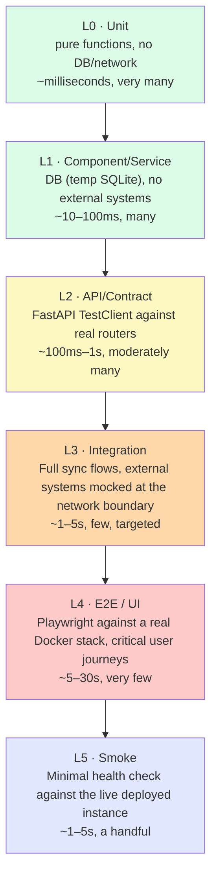
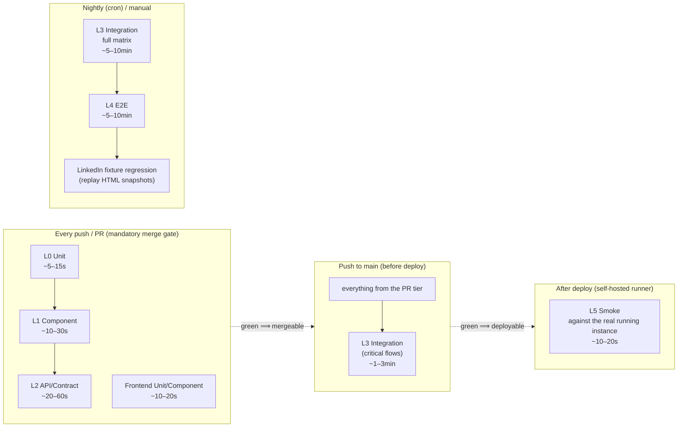

# rapport – Test Concept

> Status: **Phases 1–6 complete** (see rollout plan, section 11) — the PR gate with L0/L1/L2 tests runs in CI, L3 integration tests (AI provider, Google, LinkedIn, `sync_targeted.py`, iCloud Mail/Calendar/Reminders/Contacts/Notes) run on push to `main` and on the nightly cron. `linkedin_job_description.py` sits at 82% line coverage (see the marker-bug note in section 0 — it silently didn't run in CI at all until 2026-07-11). All 12 E2E user journeys implemented, each run once in German (every push) and a curated subset (`application-lifecycle`, `company-sync`, `backup-restore`) additionally in English on push to `main`, via the `uiLanguage` E2E fixture introduced alongside the account i18n work. L5 smoke job active after deploy (backend health, frontend, login + API). The decisions listed in section 12 remain binding guardrails for further implementation.
>
> **Current scale (2026-07-13):** 1329 backend tests (385 unit / 241 component / 516 api / 187 integration) + 93 frontend tests (up from 11 — the bulk of the growth is the i18n project: per-component language-switch tests plus the `locales.test.ts` key-parity/interpolation-placeholder suite) + 64 agent tests. PR-gate coverage (`unit or component or api`) 74% of `app/` (9968 statements — grew from 9833 with the addition of `error_keys.py`/`i18n_strings.py`, percentage unchanged); including integration tests, 87%. See section 10 for the 2026-07-11 per-module breakdown (still representative — the i18n work since then added test files rather than shifting existing router coverage meaningfully).

## 0. Starting Point (as of concept creation, 2026-07-01)

At the time this concept was written, **no** automated test coverage existed. The CI pipeline (`ci.yml`) only checked:
- Backend: `ruff` (lint) + `pyright` (informational, `continue-on-error`)
- Frontend: `tsc --noEmit` + `vite build`
- Docker buildability

There was a single standalone script (`backend/test_linkedin_extraction.py`) that tests LinkedIn scraping JS against manually captured HTML files — no test runner, no CI hookup, but a usable pattern (fixture replay instead of live scraping). This script still exists unchanged as a standalone debug tool (not part of the formal suite below).

**Status as of 2026-07-07 (602 tests total):** `backend/tests/` (447 tests, markers `unit`/`component`/`api`), `agent/tests/` (51 tests) and `frontend/src/**/*.test.tsx` (11 tests) run on every push as a mandatory gate (see `ci.yml`). Of these, 41 new tests come from Phase 1+2 of the new user-account feature (password hashing, JWT, confirmation codes, the full register/verify/login/reset HTTP flow via `/api/auth/*`, and `claim_unowned_data()` — the one-time transition of the previously account-less data set to the first confirmed account — and the per-user unique index on `CompanyProfile.name_norm`. Query scoping across the feature routers follows in Phase 3, see `docs/ARCHITECTURE.md`). An additional 49 new tests cover the LinkedIn import (job-posting text extraction, application-date parsing, company-name carryover, LinkedIn job-ID matching) — `sync_linkedin.py` went from 37% to 42% coverage. In addition, 93 L3 integration tests run on push to `main` (`pytest -m integration`: AI provider flow, Google Calendar sync, Gmail sync, the domain-based matching logic of targeted single-application sync in `sync_targeted.py`, and iCloud Mail (IMAP), Calendar + Reminders (CalDAV), Contacts (CardDAV) and now also Notes — each both globally and in targeted sync). A targeted gap analysis of error paths (see section 3) additionally identified and closed the Google token-refresh error path and the LinkedIn MergeAlias fallback as blind spots. While writing the `sync_targeted.py` tests, a real bug was found and fixed: the calendar events created directly there (Google + iCloud) did not set `external_id`, so `list_candidates()`/`manual_assign()` could not reliably find them again. While building the iCloud CalDAV tests, a second, independent bug was found and fixed in three functions (`_do_icloud_cal()`/`_do_icloud_reminders()` in `sync_icloud.py`, `_sync_icloud_reminders_for_app()` in `sync_targeted.py`): `str()` was applied directly to a vobject ContentLine object instead of to its `.value`, causing calendar titles/reminder texts to be stored as `<SUMMARY{}Text>` instead of plain text — this affected, in production, every calendar/reminder entry synced via iCloud (3 affected production events identified and cleaned up). Fix centralized as `vobj_str()` in `sync_common.py`. While researching the notes sync for tests, it was found that the active notes sync (`POST /sync/icloud/notes`) has long run via the local Rapport Agent instead of the pyicloud API/2FA login — the old pyicloud path (`_sync_notes_with_api`/`_get_pyicloud_api`/`/notes/_legacy`) is unused legacy code that the frontend no longer calls. At this point, LinkedIn Playwright fixture replay, L4 E2E, and the nightly job from this concept were not yet implemented — see the following phases for that.

**Status as of 2026-07-11 (1306 backend tests, 11 frontend tests):** Growth since 2026-07-07 came from continued per-file coverage passes across `sync_targeted.py` (58%→77%), `main.py` (33%→86%), `sync_linkedin.py` (43%→52%, judged "best-effort" — the remaining gap is the Playwright login/2FA/scraping flow, which needs dedicated fixture infrastructure beyond the existing mocks), `sync_icloud.py` (51%→83%), `contacts.py` (80%→100%), and `sync_company.py` (83%→99%). Integration tests grew from 93 to 184 as the L3 suite was extended alongside these files. **A CI-marker bug was found and fixed during a routine test-concept review:** `tests/unit/test_linkedin_job_description.py` had never carried a `unit`/`component`/`api`/`integration` marker (only `pytest.mark.asyncio`), so the CI marker filter (`-m "unit or component or api"`) silently deselected all 10 of its tests since the file was introduced — `linkedin_job_description.py` had actually been sitting at 11% real CI coverage the entire time, not the >90% recorded in earlier sessions (which had been measured by running the file in isolation, bypassing the marker filter). Fixed by adding `pytest.mark.unit`; a second, related issue in the same file (a redundant `pytest.mark.asyncio` on three synchronous tests, harmless but emitting a `PytestWarning` on every run since `pytest.ini` already sets `asyncio_mode = auto`) was fixed in the same pass. A systematic check confirmed no other test file in the suite has either problem. Current per-module coverage: see the refreshed table in [section 10](#10-coverage-targets-proposal-not-dogma).

---

## 1. Goals

1. **Prevent regressions** before they are deployed (currently: green CI ≠ working feature)
2. **Fast feedback** for the large majority of changes (seconds, not minutes)
3. **Confidence in risky areas** — sync logic, status transitions, duplicate detection/merge, cryptography — where silent data errors are costly
4. **No dependency on real external services** in normal operation (no real Gmail account, no real LinkedIn login in CI)
5. **Not the full suite on every push** — tiered execution by risk/cost

---

## 2. Test Pyramid / Tier Model



Rule of thumb: **the higher the tier, the more expensive/slower, the fewer cases** — but every tier covers something the one below it can't.

| Tier | Example in this project | How many? |
|---|---|---|
| **L0 Unit** | `norm_firma()`, `dedup_key()`, `_compute_naechster_schritt()`, status-change rules, Fernet encryption/decryption | 100+ |
| **L1 Component** | `_find_company_groups()` against a real SQLite test database with synthetic company profiles; `merge_companies()`; Excel import mapping | 50–100 |
| **L2 API/Contract** | `POST /api/applications/` → response schema is correct, event is created; `PATCH` correctly triggers the `abgesagt` flag; error cases (404, 422) | 80–150 |
| **L3 Integration** | Targeted-sync run with mocked Gmail/GCal/iCloud → correct events + contacts + PendingMatches; LinkedIn import with HTML fixture; AI assessment with a mocked LLM | 20–40 |
| **L4 E2E** | "Create application → click through statuses → rejection → reasoning visible"; "import LinkedIn link → form pre-filled → save" | 5–10 critical journeys |
| **L5 Smoke** | `GET /health` responds, `GET /api/applications/` returns 200, frontend loads, DB reachable | 5–8 checks |

---

## 3. Case Categories (Positive / Negative / Corner / Invalid Input)

For **every tested function/endpoint**, the following is worked through where relevant:

| Category | Meaning | Example |
|---|---|---|
| **Positive** | Expected normal case | Create an application with valid required fields |
| **Negative** | Expected error case, correctly rejected | Application without `firma` → 422 |
| **Corner case** | Boundary value, rare but valid combination | Company with an empty `website` field during dedup check; application with no events at all; status change directly from `signed` to `rejected` |
| **Invalid input** | Invalid/malicious input, must be handled robustly | SQL-like string in `firma`, huge text in `kommentar`, negative IDs, double JSON encoding, XSS payload in free-text fields |
| **External-system error** | External dependency returns something unexpected | Gmail API 429/500, LinkedIn shows a changed page structure, AI provider returns broken JSON, iCloud 2FA timeout |

This is not tracked as a separate test tier, but as a **mandatory checklist per test-case group** — e.g. every API endpoint test gets at least one case from each applicable category, not just a collection of happy paths.

**To be tested with particular rigor** (known sources of error from the session history):
- Race conditions in scoped sync (auto-continue poller bug)
- Empty/`null` company name during AI extraction (headhunter anonymization)
- Hashed/changing external HTML structure (LinkedIn)
- Rate-limit behavior of AI providers
- Concurrent status change via sync + manual user edit

---

## 4. Synthetic Test Data

**Principle:** No real names/emails/companies from the production DB in tests. Realistic, but generated and deterministic.

- **Backend:** `factory_boy` or `polyfactory` (Pydantic-native) for model factories — `ApplicationFactory`, `ContactFactory`, `CompanyProfileFactory`, `EventFactory` with sensible defaults and fields that can be selectively overridden for edge cases
- **Deterministic randomness:** fixed seed per test run (`Faker.seed(1234)`), so failures are reproducible
- **Freeze time-dependent logic:** `freezegun`/`time-machine` for anything that depends on `date.today()` (`naechster_schritt`, ghosting detection, AI prompt date) — otherwise tests become flaky on certain weekdays/month-ends
- **Realistic volumes for integration tests:** e.g. 50 applications with overlapping company names, to provoke dedup edge cases (similar to the real subsidiary-company duplicates that the cleanup function found live)
- **No production database backup as a test fixture** — not even anonymized, to avoid real application data (companies, contacts) accidentally ending up in test snapshots

---

## 5. Mocking Strategy for External Systems

Principle: **mock at the network boundary, not at the business-logic boundary** — i.e. we mock HTTP calls/IMAP sockets, not the `sync_google.py` functions themselves. This ensures the real parsing/error-handling logic is tested as well.

| External system | Connection type | Mocking approach |
|---|---|---|
| **Gmail / Google Calendar** | REST via `google-api-python-client` | `respx` (httpx mocking, since litellm/httpx sit underneath) or a dedicated `google-api-python-client` transport mock with recorded JSON fixtures (real but anonymized response structure) |
| **iCloud Mail (IMAP)** | `imaplib`/IMAP protocol | In-memory fake IMAP server (e.g. an `imapclient` test server or a custom minimal mock that serves `SEARCH`/`FETCH`) — no real Apple account in CI |
| **iCloud CalDAV/CardDAV** | XML over HTTP | Local fake HTTP server with static VCALENDAR/VCARD fixtures |
| **LinkedIn (Playwright scraping)** | Browser automation against the real website | **Playwright `page.route()` interception** or a local static-file server that serves recorded HTML snapshots (formalizing the existing `test_linkedin_extraction.py` pattern) — Chromium still runs for real (tests real DOM parsing), but without network access to linkedin.com |
| **AI provider (litellm)** | HTTP to Groq/Anthropic/OpenAI/Ollama | Fake provider implementation that returns deterministic JSON responses (including deliberately broken/empty responses for error-case tests); for L3 integration tests, additional `respx` mocks at the HTTP level to also test `litellm`'s own rate-limit/auth-error handling |
| **macOS bridges (files_bridge, Calls)** | Local HTTP | Simple fake HTTP server in tests (e.g. via `pytest-httpserver`) |
| **LinkedIn company page / Wikidata / Clearbit** (company enrichment) | Playwright resp. HTTP | Playwright interception for the company page, `respx` fixtures for Wikidata search/SPARQL + Clearbit, including the "nothing found" case |

**Important:** for every mocked system there must be at least **one error-case fixture** (timeout, 401, 429, broken JSON/XML, empty response) — not just the success case.

---

## 6. Tooling Proposal

| Area | Tool | Rationale |
|---|---|---|
| Backend test runner | `pytest` + `pytest-asyncio` | Standard, good FastAPI integration |
| Backend coverage | `pytest-cov` | Coverage reports, threshold gates |
| Backend factories | `polyfactory` | Pydantic/SQLAlchemy-native, less boilerplate than factory_boy |
| Backend HTTP mocking | `respx` | Cleanly mocks `httpx` (the basis for litellm calls and our own HTTP clients) at the transport level |
| Backend time mocking | `freezegun` or `time-machine` | Deterministic `date.today()`-dependent tests |
| Backend DB isolation | SQLite `tmp_path` fixture per test run (no test container needed, since the project itself uses SQLite) | Consistent with the production setup |
| Backend API tests | `fastapi.testclient.TestClient` / `httpx.AsyncClient` | No real server needed |
| Frontend unit/component | `vitest` + `@testing-library/react` | Fits the Vite setup, fast |
| Frontend API mocking | `msw` (Mock Service Worker) | Intercepts `fetch` calls from `api/client.ts`, works identically in tests and in dev mode |
| E2E | `Playwright` (already a backend dependency, same language/ecosystem reusable) | Drives a real browser against a real Docker Compose stack |
| Contract safeguarding | OpenAPI schema snapshot test (FastAPI generates automatically) | Prevents unintended breaking changes to the API without having to maintain every endpoint individually |

---

## 7. Test-Case Matrix per Functional Area (excerpt — to be completed in full)

| Area | L0 Unit | L1 Component | L2 API | L3 Integration | L4 E2E |
|---|---|---|---|---|---|
| Status transitions | Rule functions (`abgesagt` auto-set, `sub_status` reset) | — | PATCH endpoint triggers event | — | Kanban drag & drop visibly changes status |
| Dedup/cleanup | `norm_firma`, `dedup_key` | `_find_*_groups()` against test DB with known duplicate patterns | `/cleanup/preview` + `scope` filtering | Full cleanup run incl. merge reassignment | Cleanup button shows the right category |
| Sync (Gmail/GCal/iCloud) | Parsing helpers (date, footer extraction) | Contact-upsert logic | Targeted-sync endpoint response shape | Full sync run with fixture data → correct events/PendingMatches | — (too slow/fragile for E2E) |
| LinkedIn import | URL validation, company-name extraction fallbacks | — | `/extract-from-linkedin-url` with mocked Playwright response | Full import flow with HTML fixture → correct company matching | Import button → form pre-filled |
| AI assessment | Prompt building, response parsing | `assess_application()` with fake provider | `/ai-assess` endpoint error cases (429, no provider configured) | Batch run with multiple fake responses incl. rate-limit simulation | "Reassess" updates UI immediately |
| Encryption | `encrypt_api_key`/`decrypt_api_key` round-trip, wrong key | — | Settings endpoint never stores plaintext in the response | — | — |
| Merge/companies | — | `merge_companies()` reassignment correctness | `/merge/companies` error cases (non-existent ID) | — | Merge dialog end-to-end |

*(This matrix is meant as a starting point — it will be completed per area during implementation.)*

### 7.1 E2E Journey List (expanded — decision from section 12)

Deliberately expanded beyond the original 5–10, since sync flows, the merge dialog, and backup/restore should also be covered end-to-end:

1. Create application → click through statuses → rejection → reasoning visible ✅
2. Kanban drag & drop changes status incl. sub-status reset ✅
3. Import LinkedIn link → form pre-filled → company matched/created → save ✅
4. Cleanup button shows context-dependent category, preview → run → list updates ✅
5. Merge dialog (applications/contacts/companies): select → merge → reassignment visible ✅
6. Targeted sync for one application (with mocked sources): start → progress → events/contacts appear in the timeline ✅
7. Manual candidate assignment (full-text search → multiselect → assign) ✅
8. AI assessment: "Reassess" → traffic light + reasoning appear without a manual reload ✅
9. Batch AI assessment with live progress display (incl. simulated rate-limit case) ✅
10. Company sync with selection: only selected companies are synced (regression test for the auto-continue poller bug) ✅
11. Configure backup → manual run → restore from backup file
12. Excel import (original format) → applications correctly mapped → Excel export → round-trip comparison

---

## 8. Tiering in CI (Core Requirement: Not Everything Every Time)



**Implemented via pytest markers + separate CI jobs**, analogous to the existing `ci.yml` pattern:

```python
@pytest.mark.unit          # L0 — always runs
@pytest.mark.component     # L1 — always runs
@pytest.mark.api           # L2 — always runs
@pytest.mark.integration   # L3 — runs on main push + nightly
@pytest.mark.slow          # additional marker for explicitly slow cases
```

```bash
# PR gate:
pytest -m "unit or component or api"

# Main push (before deploy):
pytest -m "unit or component or api or integration"

# Nightly:
pytest -m "integration" --full-matrix   # extended fixture sets
pytest tests/e2e/ --headed=false
```

Frontend analogously: `vitest run` (unit/component) always, `playwright test` only on main push/nightly.

**Additional job:** `smoke` runs after a successful deploy (extension of the existing `deploy` job in `ci.yml`) against the real, just-deployed instance — catches Docker/configuration problems that would not be visible at any earlier tier (e.g. a missing env var, a broken volume mount).

---

## 9. Proposed Folder Structure

```
backend/
└── tests/
    ├── conftest.py              # shared fixtures: temp DB, Faker seed, fake AI provider
    ├── factories.py              # ApplicationFactory, ContactFactory, CompanyProfileFactory, …
    ├── fixtures/
    │   ├── linkedin_html/        # recorded job/profile pages (formalizes test_linkedin_extraction.py)
    │   ├── gmail_responses/      # anonymized JSON fixtures
    │   ├── icloud_caldav/        # VCALENDAR/VCARD examples
    │   └── ai_responses/         # LLM JSON responses (good + broken)
    ├── unit/                     # L0 — mirrored 1:1 to backend/app/ modules
    │   ├── test_dedup.py
    │   ├── test_status_transitions.py
    │   └── test_crypto.py
    ├── component/                 # L1 — with test DB
    │   ├── test_cleanup_company_groups.py
    │   └── test_merge_companies.py
    ├── api/                        # L2 — TestClient
    │   ├── test_applications_api.py
    │   └── test_cleanup_api.py
    └── integration/                 # L3 — mocked external systems
        ├── test_targeted_sync_flow.py
        ├── test_linkedin_import_flow.py
        └── test_ai_assessment_flow.py

frontend/
├── src/**/*.test.tsx           # component tests alongside the component (vitest convention)
└── e2e/
    ├── application-lifecycle.spec.ts
    ├── linkedin-import.spec.ts
    └── cleanup-flow.spec.ts
```

---

## 10. Coverage Targets (Proposal, Not Dogma)

- **L0/L1 (backend logic):** 80%+ line coverage on `app/dedup.py`, `app/audit.py`, status logic in `models.py`/`applications.py` — deliberately high, because silent errors here are the most costly
- **L2 (API):** every endpoint at least 1 positive + 1 negative case — not a percentage target, but checklist completeness
- **L3 (integration):** no coverage target — focus on the 5–8 most critical end-to-end data flows (sync, LinkedIn import, AI assessment, cleanup/merge)
- **L4 (E2E):** deliberately kept small (5–10 journeys) — expensive to maintain, only for things that can't be meaningfully tested any other way (drag & drop, modal interactions)
- **No global coverage gate** (e.g. "80% overall") — experience shows this leads to pointless tests written for coverage numbers rather than real error coverage

### Historical Status (measured 2026-07-06, `pytest --cov=app`)

**Overall: 54% line coverage across `app/` (8978 statements, 4086 untested, as of 2026-07-06).** The average conceals a very uneven distribution that matches the rollout plan (section 11) — high where Phases 1–4 deliberately started first, low where Phases 5–6 (E2E, LinkedIn fixture replay) as well as the permanently lower-priority files (`sync_linkedin.py`, `sync_files.py`, `export_pdf.py` among others) start:

| Area | Coverage | Assessment |
|---|---|---|
| `dedup.py`, `models.py`, `schemas.py`, `startup_check.py`, `agent_client.py` | 98–100% | The 80% target from above reached — the "sharp" L0 areas from Phase 2 |
| `ai/provider.py` | **96%** (↑ from 78%) | Error mapping (AINotConfigured, AuthenticationError, JSON mode, model not found) now fully covered by gap-closing tests |
| `merge.py`, `cleanup.py`, `geo.py` | 84–96% | Phase 3 |
| `sync_common.py` | 76% | Shared sync helpers (classification, company/contact index, `vobj_str()`) — indirectly covered through all sync-router tests |
| `applications.py`, `companies.py`, `settings.py`, `contacts.py`, `ai/tasks.py` | 40–64% | API base cases covered, many edge cases (still) not |
| `sync_google.py` | **65%** (↑ from 62%) | Gmail + Calendar incl. "not connected" cases and the token-refresh error path (`_refresh_if_needed`) now covered, rest (OAuth flow, reset endpoints) open |
| `sync_targeted.py` (1258 lines, second-largest file) | **57%** (↑ from 5%) | Logic helpers, API endpoints, domain/text filters for all six sources (Gmail, Calendar, iCloud Mail/Calendar/Reminders/Contacts/Notes) as well as calls covered — Phase 4 for this file thus complete |
| `sync_linkedin.py` | **42%** (↑ from 37%) | Job-posting text extraction (`_extract_jobs_from_text`), application-date parsing (`_parse_date`), LinkedIn job-ID matching (`_li_job_id_from_url`/`_quick_match`) as well as company-name/date carryover in `_find_or_create_application` now covered. The Playwright scraping part (login, navigation, scrolling) remains open (Phase 6) |
| `review.py`, `main.py`, `analytics.py` | 24–35% | Largely untested |
| `sync_icloud.py` (1275 lines, largest backend file) | **50%** (↑ from 23%) | Mail (IMAP), Calendar + Reminders (CalDAV, incl. change detection/orphaned events), Contacts (CardDAV, incl. regression tests for two live-verified bulk-import bugs) and Notes (active sync runs via the local agent, not via pyicloud) covered. The unused old pyicloud 2FA login path (`_sync_notes_with_api`/`_get_pyicloud_api`/`/notes/_legacy`) remains deliberately untested (the frontend no longer calls it) |
| `sync_files.py`, `import_excel.py`, `export_pdf.py` | 16–17% | Essentially untested |
| `linkedin_job_description.py` | **>90% by lines, ~95% by branches** | *(This claim from 2026-07-06 turned out to be measured by running the test file in isolation — under the real CI marker filter the file's tests never ran at all, see the 2026-07-11 update above and the corrected row below.)* |
| `database.py` | 8% | Mostly historical inline migrations — lower priority, since each migration is only relevant once, at the time of the schema update |

### Current Status (measured 2026-07-11, `pytest --cov=app`)

**PR-gate coverage (`-m "unit or component or api"`, what CI actually enforces on every push): 74% of `app/` (9833 statements, 2584 untested).** **Including L3 integration tests (`-m "... or integration"`, what actually runs by the time `main` is deployed): 87%.** The gap between the two numbers is by design for the sync routers (section 2/8: heavy external-system mocking lives at L3, not L0–L2) — shown separately below wherever it's large enough to matter for prioritization.

| Area | PR-gate | +Integration | Assessment |
|---|---|---|---|
| `dedup.py`, `models.py`, `schemas.py`, `contacts.py`, `attachments.py`, `audit_log.py`, `calendar.py`, `export_excel.py` | 98–100% | same | Fully covered — the "sharp" L0/L2 areas plus the `contacts.py` gap closed 2026-07-11 (was 80%: `GET /` search/scoping/enrichment and `DELETE /bulk` were untested) |
| `sync_company.py` | 99% | 99% | Closed 2026-07-11 (was 83%): `_get_linkedin_context()`, `resolve_company_candidate()` error/logo branches, and the full `_run_sync_batch()` Wikidata success path (previously only covered up to the cancel point) |
| `database.py`, `applications.py`, `companies.py`, `settings.py`, `backup.py`, `sync_files.py`, `export_pdf.py`, `merge.py` | 91–99% | same | Stable, no significant integration-only gap |
| `ai/provider.py` | 41% | **96%** | Provider error-mapping tested at L3 (fake LLM responses), not at L0 — matches the documented mocking strategy |
| `ai/tasks.py` | 11% | **100%** | Same pattern — prompt building/response parsing is exercised entirely through integration-level fake-provider tests |
| `linkedin_job_description.py` | **82%** | 82% | Marker bug fixed 2026-07-11 (see status note above) — genuinely at 82%, not the previously assumed >90% |
| `main.py` | 86% | same | Raised 2026-07-11 from 33% — `_run_source()` concurrency guard, `_auto_link_contacts()`, health/schedule endpoints, full background sync loop |
| `sync_common.py` | 78% | 87% | Shared sync helpers, indirectly covered through all sync-router tests |
| `sync_google.py` | 66% | **92%** | OAuth flow/reset endpoints remain the open PR-gate gap; covered at L3 |
| `sync_icloud.py` (1298 lines, largest backend file) | 58% | **83%** | Raised 2026-07-11 from 51%→83% combined; Mail/Calendar/Reminders/Contacts/Notes covered, unused legacy pyicloud path deliberately untested |
| `sync_linkedin.py` | 52% | 52% | Judged "best-effort" after the 2026-07-10 pass (43%→52%) — remaining gap is the Playwright login/2FA/scraping flow, which needs dedicated fixture infrastructure beyond current mocks (open, see Phase 6 follow-up) |
| `sync_targeted.py` (1292 lines, second-largest file) | 28% | **77%** | The PR-gate number looks like a regression from the 2026-07-06 "57%" entry but isn't — that older figure was measured including integration tests; the two numbers were never comparing the same thing |
| `test_e2e.py` | 0% | 0% | Test-only router, only active under `E2E_TESTING=true` — not meaningfully coverable by pytest |

**Note on the `sync_targeted.py` figure above:** this is the single largest remaining PR-gate gap (929 untested statements). It is not a new regression — the file has always relied heavily on L3-mocked integration tests for its external-source logic — but it means a plain `pytest -m "unit or component or api"` run substantially understates how tested this file actually is. Anyone comparing coverage numbers across sessions should state which marker set was used.

**Important for prioritizing Phase 4:** the thinnest-tested files (`sync_linkedin.py`) are exactly the sync routers where the session history has found the most real production bugs (see section 3, "To be tested with particular rigor"). The coverage gap is therefore not coincidental — it marks precisely the currently biggest risk.

---

## 11. Rollout Plan (Phases, Since Greenfield)

| Phase | Content | Result |
|---|---|---|
| **1** ✅ | pytest/vitest setup, `conftest.py`, first factories, CI job scaffold (even if nearly empty) | Basic scaffold in place, PR gate exists |
| **2** ✅ | L0 unit tests for the "sharp" areas from section 3 (dedup, status logic, crypto) | The previously silent sources of error are now safeguarded — `test_dedup.py`, `test_naechster_schritt.py`, `test_crypto.py` |
| **3** ✅ | L1/L2 for applications/cleanup/merge (most active areas of this session) | Regression protection for just-built features — `test_merge_api.py`, `test_cleanup_app_groups.py`, `test_cleanup_contact_groups.py`, `test_cleanup_api.py`, plus organically arising bugfix tests (company dedup, event groups, iCloud contact sync, applications API). Along the way, two critical, live-reproduced data-loss bugs were found and fixed in `merge.py`/`cleanup.py` (events were deleted along with the application during merge/cleanup by the `delete-orphan` cascade instead of being reassigned) |
| **4** ✅ | Mocking infrastructure for Gmail/iCloud/LinkedIn/AI + L3 integration tests | **AI provider, Google (Calendar/Gmail/token refresh), LinkedIn status logic + MergeAlias fallback, `sync_targeted.py` (single-application sync), and iCloud (Mail/Calendar/Reminders/Contacts/Notes) are fully mocked and tested** — each at the appropriate network boundary (`googleapiclient.discovery.build`, `imaplib.IMAP4_SSL`, `caldav.DAVClient`, `fetch_all_vcards()`, `litellm.acompletion`, local agent via `httpx.AsyncClient`). Details on the individual steps, live bugs found (among others LinkedIn no-op reviews, missing `external_id` on targeted-sync-created calendar events, the `vobj_str()` repr bug in iCloud calendar/reminder titles, two iCloud contact bulk-import bugs) and per-file coverage jumps: see commit history and changelog (v3.33.x, July 2026). The only thing still open from Phase 4: LinkedIn Playwright fixture replay (see section 3/nightly tier, Phase 6) |
| **5** ✅ | E2E suite (12 journeys) + smoke job after deploy | **All 12 E2E journeys implemented** (lifecycle, Kanban, LinkedIn import, cleanup, merge, targeted sync, manual assignment, AI assessment, batch AI, company sync, backup/restore, Excel round-trip). L5 smoke job active in deploy (backend health, frontend, login + API). |
| **6** ✅ | Nightly cron job, fixture-maintenance routine (LinkedIn HTML ages) | Nightly cron (`0 6 * * *`) enabled in CI (E2E + integration tests). LinkedIn Playwright fixture replay via 10 unit tests (7 async + 3 JS structure) for `linkedin_job_description.py` — these tests existed since this phase but carried no CI marker, so they silently never ran in any CI job until the bug was found and fixed 2026-07-11 (see status note at the top and section 10); the file is now genuinely covered at 82%, actually enforced by the PR gate. |

The ordering is a proposal — a discussion point on whether, e.g., mocking infrastructure should come earlier if sync bugs are currently the most painful.

---

## 12. Decisions (agreed on 2026-07-01)

| # | Question | Decision |
|---|---|---|
| 1 | Order of phases | **Sharp unit tests first** (dedup, status logic, crypto) — quickly effective, barely any infra lead time. Mocking infrastructure for sync follows in Phase 4 as originally proposed. |
| 2 | Coverage targets | **Checklist approach** (see section 10) — no global percentage gate, focus on real error coverage instead of number cosmetics. |
| 3 | LinkedIn fixture maintenance | **Manual trigger** — HTML snapshots are re-recorded when a scraper break is suspected, no automated diff check. |
| 4 | E2E scope | **Expanded to 12 journeys** (instead of 5–10) — sync flows, merge dialog, backup/restore, and Excel round-trip must also be covered. See [section 7.1](#71-e2e-journey-list-expanded--decision-from-section-12). |
| 5 | Test-data realism | **Faker-generated only** — no anonymized production snapshot, no risk of real data ending up in test fixtures. |
| 6 | CI runtime budget | **PR gate < 1 minute** (L0+L1+L2) — as originally proposed. |
| 7 | Implementation scope | **Full structure** from L0 to L5 — no stripped-down scaffold, pays off for maintenance effort in the medium term. |

These decisions are binding for implementation from now on (see rollout plan, section 11).

---

## 13. Cross-OS Testing Strategy

With the portability work (feature/portability branch), the Docker containers (backend + frontend) run identically on macOS, Windows, and Linux. The main cross-platform concerns are:

### 13.1 Backend (Docker Container)

The backend runs in a Linux Docker container on all host platforms. **No additional OS-specific testing is needed** because:
- The container image is identical regardless of host OS
- SQLite, Python, and all dependencies are Linux-native inside the container
- The only host-dependent code paths are behind `host.docker.internal` (agent communication)

### 13.2 Agent (Native Host Application)

The agent runs natively on the host (outside Docker). Platform-specific code lives in `agent/providers/`:

| Module | macOS | Windows | Linux |
|--------|-------|---------|-------|
| `files.py` | osascript/AppleScript | tkinter filedialog | zenity/kdialog/tkinter |
| `notes.py` | JXA (Apple Notes) | stub (not available) | stub (not available) |
| `calls.py` | SQLite (iPhone/WhatsApp) | stub (not available) | stub (not available) |
| `service.py` | launchd | Task Scheduler | systemd |
| `tray.py` | rumps | pystray | pystray |

**Testing approach for the agent:**

1. **Unit tests (L0):** Mock platform-specific subprocess calls. Already implemented for macOS in `agent/tests/test_providers_mac.py`. Add equivalent tests for Windows/Linux providers.

2. **Integration tests (L1):** Test factory dispatch (`make_files_provider()`, etc.) returns correct type per platform. Test `service.is_registered()` / `register()` / `unregister()` with mocked subprocess.

3. **Manual testing matrix:** For full validation, test on actual OS instances:
   - macOS: native (current development environment)
   - Windows: via GitHub Actions `windows-latest` runner or local VM
   - Linux: via Docker (already tested) or local VM/GitHub Actions `ubuntu-latest`

### 13.3 CI/CD Pipeline

The CI pipeline (`ci.yml`) already runs on `ubuntu-latest` for backend/frontend tests. The deploy job remains macOS-specific (self-hosted runner) — this is documented as a known limitation, not a gap to close.

**Optional future enhancement:** Add a Windows CI job to validate agent tests on Windows:
```yaml
  agent-windows:
    name: Agent (Windows)
    runs-on: windows-latest
    steps:
      - uses: actions/checkout@v4
      - uses: actions/setup-python@v5
        with:
          python-version: "3.11"
      - run: pip install -r agent/requirements.txt -r agent/requirements-dev.txt
      - run: pytest agent/tests/ -m "unit"
```

### 13.4 Key Portability Verification Checklist

- [ ] `docker compose up -d --build` works without pre-created volumes
- [ ] `host.docker.internal` resolves on Linux Docker (via `extra_hosts`)
- [ ] Backup path derivation from `DATABASE_URL` works (not hardcoded `/app/data/`)
- [ ] Temp file paths use `tempfile.gettempdir()` (not `/tmp/`)
- [ ] Agent providers gracefully handle missing platform tools (zenity, tkinter)
- [ ] System tray falls back to headless mode when pystray is unavailable
- [ ] PDF generation finds fonts on all platforms (macOS/Linux/Windows paths)
